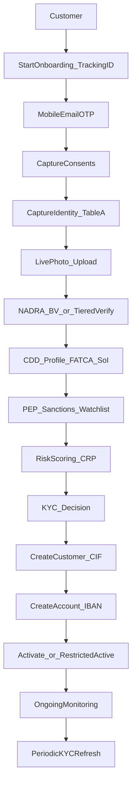

# 11. Recommended Digital Bank KYC Process (Conventional DRB)

> Designed for **our** Conventional Digital Retail Bank against Consolidated Customer Onboarding Framework (2025) + AML/CFT/CPF Regulations.  
> Improves the brief’s skeleton with SBP-mandatory tiers, debit-block path, video KYC, tracking ID, and shared e-KYC branch.  
> Not legal advice.

**Customer-facing screen journey:** [05a-kyc-user-journey.md](05a-kyc-user-journey.md)  
**All customer journey types:** [05b-kyc-user-journeys-catalog.md](05b-kyc-user-journeys-catalog.md)

Diagrams: [diagrams/01-e2e-kyc-journey.mmd](diagrams/01-e2e-kyc-journey.mmd), [diagrams/02-sbp-compliant-onboarding.mmd](diagrams/02-sbp-compliant-onboarding.mmd), [diagrams/13-kyc-user-journey.mmd](diagrams/13-kyc-user-journey.mmd), [diagrams/14-kyc-user-journey-screens.mmd](diagrams/14-kyc-user-journey-screens.mmd).



---

## Design goals

| Goal | Target |
|------|--------|
| Regulatory | Meet **A** controls; encode **B**; optionally adopt **C** |
| TAT | Decision ≤ 2 working days for individuals once application complete |
| UX | Resume ≤ 30 days; tracking ID; progress visibility |
| Risk | STP for low risk; manual/EDD for medium-high / hits |
| Resilience | Local KYC complete without shared e-KYC |

---

## End-to-end workflow

```text
Customer
   |
   v
Start Onboarding (channel, device, geo/IP) ---- generate Tracking ID (in-app only)
   |
   v
Mobile Verification (OTP)  [email OTP optional] ---- SMS Tracking ID on OTP success
   |
   v
Mobile Verification (OTP)  [email OTP optional]
   |
   v
Customer Consents (T&Cs, privacy, KFS, BV/NADRA, e-KYC optional)
   |
   +---- if e-KYC consented & enabled ----> Shared e-KYC prefetch (non-blocking fallback)
   |
   v
CNIC / Identity Information (Table-A basics + ID fields)
   |
   v
Live Photo capture (no local device retention; realtime upload)
   |
   v
NADRA Identity Verification
   |
   +-- BV success ---------------------->
   |                                      |
   +-- BV eligible failure ---------------> Verisys + CNIC-MSISDN pairing + OTP/callback
   |                                      |
   +-- still failing --------------------> Video KYC + Verisys (digital bank path)
   |                         or           |
   +-- open with debit block ------------> until BV/alternate completed
   |
   v
Customer Profile / CDD (occupation, SoI/SoF if applicable, purpose, expected activity, FATCA/CRS)
   |
   v
Document upload (risk-based Annex-B; self-declaration when allowed)
   |
   v
PEP / Sanctions / Watchlist Screening
   |
   +-- confirmed sanctions/proscribed hit --> REJECT + written reason + audit
   |
   v
Risk Scoring (CRP)
   |
   +-------- Low Risk --------> Straight Through Approval
   |
   +------ Medium Risk -------> Additional Verification / limited auto + queue
   |
   +-------- High Risk -------> EDD / Video KYC / Manual Review (maker-checker)
   |
   v
KYC Decision (Approve / Reject / Pending info)  -- notify within TAT
   |
   v
Customer (CIF) Creation
   |
   v
Account Creation (product, IBAN, limits, status)
   |
   +-- debit block flag? --> Restricted Active
   +-- else --------------> Active / Activation
   |
   v
Initial funding rules (product policy)
   |
   v
Ongoing Monitoring (TMS) + Periodic KYC Refresh + Remediation
```

---

## Stage detail

### 1. Start onboarding

- Create `kyc_applications` row; status `INITIATED`  
- Capture device ID, app version, IP, geo (permissioned), channel  
- Issue **tracking ID** and display it in-app (**A** generate). Do **not** SMS/email here — no mobile/email captured yet  
- Out-of-band notify initiation (**A**) after contact exists: SMS on OTP success; email when captured  

### 2. Mobile / email verification

- OTP with attempt limits, expiry, cool-down (**B/C**; also supports MSISDN tier)  
- Bind verified mobile to application (unique constraints vs fraud rules)  
- SMS Tracking ID + “application started” on OTP success; email the same when email is stored  

### 3. Consents

Capture versioned consents:

- Terms & account conditions  
- Privacy / data processing  
- NADRA/BV processing  
- Optional Shared e-KYC read/write  
- Marketing (optional, separate)  

### 4. Identity + live photo

- Collect Table-A identity fields  
- Capture live photo; transmit encrypted realtime; **do not store on device** (**A**)  
- Face match live photo to ID portrait (**B/C** tech to satisfy live-photo verification intent)  
- Optional liveness (**B/C** encouraged)  

### 5. NADRA / verification

Orchestrate Consolidated §F tiers. Persist verification reference IDs — **not** raw biometric templates if vendor allows tokenized evidence.

### 6. Profile / CDD

- Occupation, employer/business, source of income/funds (risk-based docs)  
- Purpose of account; expected turnover  
- FATCA/CRS  
- PEP self-declaration **plus** independent screening (**A**)  

### 7. Screening

- Sanctions/TFS (UNSC + ATA) — hard stop on true match after alert adjudication policy  
- PEP lists  
- Internal watchlists / prior rejects  
- Adverse media optional (**B/C**)  

### 8. Risk scoring

Inputs (illustrative CRP factors — finalize in Compliance policy):

- Product & channel (digital NFTF)  
- Geography / IP anomalies  
- Occupation / DNFBP  
- Expected turnover  
- PEP / adverse media  
- Verification assurance level (BV vs Verisys vs video)  
- Fraud signals (device, SIM, duplicates)  

Outputs: `LOW` | `MEDIUM` | `HIGH` + EDD flag + recommended limits.

### 9. Decisioning

| Outcome | When | Account impact |
|---------|------|----------------|
| APPROVED STP | Low risk, clean screening, BV OK | Full product limits per policy |
| APPROVED_RESTRICTED | Verisys debit-block path | Debit blocked until BV/alternate |
| ADDITIONAL_INFO | Medium gaps | Clock rules for TAT communication |
| MANUAL_REVIEW | Medium risk / soft hits | Case queue |
| EDD_REQUIRED | High risk / PEP | Video KYC + senior approval as required |
| REJECTED | Sanctions true match, fraud, policy | Written reason (**A**) |

### 10. CIF / account

- Customer Service creates CIF  
- Account Service + Core Banking: account number/IBAN, product, status, limits  
- Notification of activation / restrictions  

### 11. Post-onboarding

- TMS rules + STR workflow to FMU  
- Periodic refresh by risk rating  
- CNIC expiry / renewed ID within 3 months if opened on token  
- Dormancy per AML definition (login/activity)  
- KYC remediation & reclassification  

---

## SBP-driven improvements vs brief skeleton

| Added step | Why |
|------------|-----|
| Tracking ID at start | Consolidated §I |
| Geo/IP | §F.3 |
| Live photo before/with verification | §D Table-A / digital |
| Explicit BV tier ladder + debit block | §F.1.v |
| Video KYC for branchless digital bank | §F.1.v.f / §G |
| FATCA/CRS & Annex-B SoI | Table-A / Annex-B |
| Shared e-KYC optional branch | CL22 + §H |
| Written decline reasons | §I.3 |
| 30-day resume | §J.iii |

---

## Product / phase configuration

| Phase | KYC behavior |
|-------|--------------|
| Pilot | Same CDD quality; tighter limits; possibly invite-only eligibility |
| Commercial | Full retail acquisition; same core KYC state machine |

---

## RACI (summary)

| Activity | System | Compliance | Ops analyst | Customer |
|----------|--------|------------|-------------|----------|
| Data capture | Auto | Policy | — | Provides |
| BV/NADRA | Auto | Oversee | Exception | Biometrics |
| Screening | Auto | Tune lists | Adjudicate hits | — |
| Risk score | Auto | Own model | Override w/ maker-checker | — |
| EDD / video | Hybrid | Approve PEPs | Conduct | Attends |
| Account open | Auto after approve | — | Manual rare | — |
