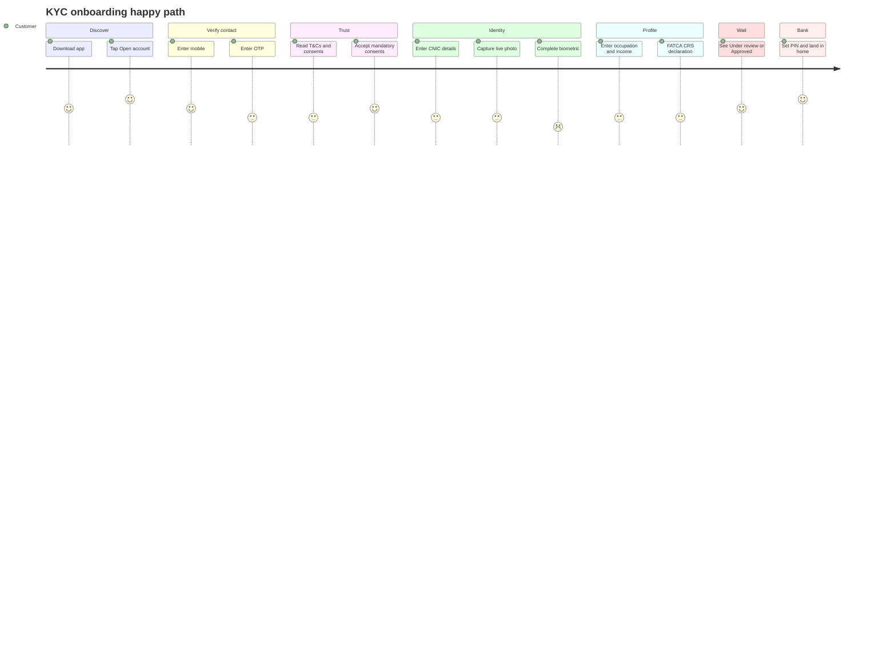
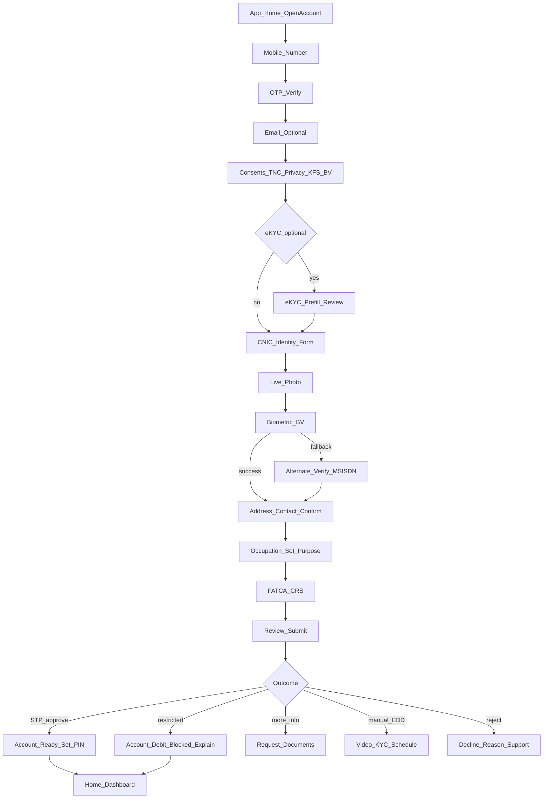

# KYC User Journey (Conventional Digital Retail Bank)

> Customer-facing journey for **our** Conventional DRB mobile/web onboarding.  
> Aligns with [05-recommended-kyc-process.md](05-recommended-kyc-process.md), Consolidated Customer Onboarding Framework (2025), and [08-state-machine.md](08-state-machine.md).  
> UX labels are illustrative (**D**); regulatory steps marked **A** where mandatory.  
> Not legal advice. Fictional personas only — no real PII.

Related diagram: [diagrams/13-kyc-user-journey.mmd](diagrams/13-kyc-user-journey.mmd)  
**All customer journey types:** [05b-kyc-user-journeys-catalog.md](05b-kyc-user-journeys-catalog.md)  
**Interactive explorer:** [05c-kyc-interactive-journeys.html](05c-kyc-interactive-journeys.html)  
**All 38 workflows (PDF):** [05c-kyc-customer-journeys.pdf](05c-kyc-customer-journeys.pdf)

---

## Personas (illustrative)

| Persona | Profile | Expected path |
|---------|---------|---------------|
| **Ayesha** | Salaried, first digital bank account, low risk | Happy path / STP |
| **Bilal** | Fingerprints unclear / BV fails | Verisys + MSISDN + OTP; or debit-block / video KYC |
| **Sana** | Higher expected turnover / possible PEP link | EDD + video interview + wait for decision |

---

## Journey map (happy path — Ayesha)



---

## End-to-end screen flow



---

## Step-by-step user journey

For each step: **Customer sees / does** · **System does** · **State** · **Class** · **Success criteria** · **Error / alternate**

### Step 0 — Discover & start

| | Detail |
|--|--------|
| Customer | Opens app/web → **Open savings/current account** |
| System | Creates application; captures channel, device hash, IP, geo (if permitted); issues **Tracking ID** and **shows it on screen** (copy / persist in app session). **No SMS/email yet** — mobile and email are not collected until Steps 1–2 |
| State | `INITIATED` |
| Class | **A** (tracking ID generated); **C** (progress UX) |
| UI | Tracking ID visible; progress bar “Step 1 of N”; language EN/UR |
| Success | Application ID + tracking ID shown in-app |
| Alternate | Bot/captcha fail → retry |
| Notify | Out-of-band **notify initiation** (**A**, Consolidated §I) runs after a channel exists: SMS on OTP success (Step 1); email if captured (Step 2) |

### Step 1 — Mobile verification

| | Detail |
|--|--------|
| Customer | Enters mobile (PTA-registered in own name — explained in helper text) → receives OTP → enters OTP |
| System | Send OTP; verify; bind mobile to application. **On OTP success:** SMS “application started” + **Tracking ID** (first time a destination exists). Do not SMS Tracking ID to an unverified number |
| State | `CONTACT_VERIFIED` |
| Class | **A**/tier control; **A** notify initiation once MSISDN verified; **B/C** OTP security |
| Success | Mobile verified badge; Tracking ID also in SMS for resume/support |
| Alternate | Wrong OTP / lockout → cool-down; change number (new attempt rules) |

### Step 2 — Email (optional / where available)

| | Detail |
|--|--------|
| Customer | Enters personal email; optional email OTP |
| System | Store contact; use for status alerts. If email present (OTP if required): send Tracking ID + application-started notice |
| State | remains `CONTACT_VERIFIED` (or sub-flag email_verified) |
| Class | **A** collect where available; **A** notify on a collected channel |

### Step 3 — Consents & disclosures

| | Detail |
|--|--------|
| Customer | Reviews Key Fact Sheet, T&Cs, privacy; accepts NADRA/BV processing; optionally Shared e-KYC; marketing separate toggle (off by default) |
| System | Versioned consent records; block continue until mandatory accepted |
| State | `CONSENT_CAPTURED` |
| Class | **A/B** |
| Success | Timestamped consents stored |
| Alternate | Decline mandatory → exit with save draft option |

### Step 4 — Shared e-KYC (optional branch)

| | Detail |
|--|--------|
| Customer | If consented and platform live: sees “We found your KYC — review details” or “No shared KYC — continue” |
| System | Adapter lookup; prefill editable fields; never skip sanctions/BV policy |
| State | `EKYC_PREFILL_APPLIED` or skip |
| Class | **A** when platform operational + consent |
| Alternate | Timeout/miss → silent continue to manual entry |

### Step 5 — Identity information

| | Detail |
|--|--------|
| Customer | Enters/confirm: full name, father/spouse, mother maiden, DOB, place of birth, gender, CNIC/NICOP/POC/POR/ARC number, issue & expiry |
| System | Format/checksum validation; eligible ID types only; encrypt sensitive fields |
| State | `IDENTITY_CAPTURED` |
| Class | **A** Table-A |
| UI | OCR/scan assist (**C/D**) — customer must confirm fields |
| Alternate | Expired CNIC → prompt NADRA token/receipt path; explain 3-month renewal |

### Step 6 — Live photo

| | Detail |
|--|--------|
| Customer | Centers face in frame; captures live photo (guidance: good light, no mask) |
| System | Realtime encrypted upload; **no photo left on device**; face match vs ID portrait; optional liveness |
| State | `LIVE_PHOTO_CAPTURED` |
| Class | **A** live photo; **B/C** liveness/match tech |
| Alternate | Fail match → retry N times → manual/video path |

### Step 7 — Biometric / NADRA verification

| | Detail |
|--|--------|
| Customer | Completes in-app fingerprint or facial BV (as NADRA product allows); clear “why we need this” copy |
| System | NADRA adapter BV; on success advance; on eligible failure start Verisys + CNIC–MSISDN pairing + OTP/callback |
| State | `IDENTITY_VERIFICATION_IN_PROGRESS` → `IDENTITY_VERIFIED` or `VIDEO_KYC_PENDING` |
| Class | **A** |
| Success | “Identity verified” |
| Alternate A | Verisys + MSISDN success |
| Alternate B | Open later with **debit block** explanation |
| Alternate C | Schedule **video KYC** (branchless digital bank path) |
| Alternate D | Guide to partner bank branch if third-party reliance used |

### Step 8 — Address & contact confirm

| | Detail |
|--|--------|
| Customer | Permanent address (per ID), current mailing address, emergency contact |
| System | Validate completeness; flag address mismatch for risk |
| State | toward `PROFILE_COMPLETE` |
| Class | **A** |

### Step 9 — Occupation, source of income/funds, purpose

| | Detail |
|--|--------|
| Customer | Selects profession; employer/business; purpose of account; expected monthly income / turnover; uploads docs **or** self-declaration when policy allows (low risk / informal profession) |
| System | Annex-B document rules via Risk/Doc policy; store self-declaration + fund provider fields if used |
| Class | **A** (risk-based docs) |
| Alternate | High turnover → require documents before submit |

### Step 10 — FATCA / CRS & tax

| | Detail |
|--|--------|
| Customer | Declares tax residency / US person / other nationalities; uploads evidence if non-resident tax |
| System | Store tax profile; route EDD if needed |
| Class | **A** |

### Step 11 — PEP self-declaration

| | Detail |
|--|--------|
| Customer | Answers PEP / family / close associate questions honestly |
| System | Store declaration; still run independent PEP screening |
| Class | **A** (PEP controls) + declaration **B/D** UX |

### Step 12 — Review & submit

| | Detail |
|--|--------|
| Customer | Reviews summary (masked CNIC); confirms accuracy; submits |
| System | Marks documents complete → starts TAT clock (≤ 2 WD); runs screening + risk |
| State | `PROFILE_COMPLETE` → `SCREENING_*` → `RISK_*` |
| Class | **A** TAT |
| UI | “You can track with ID TRK-…”; save/resume reminder (30 days if abandoned earlier) |

### Step 13 — Decision outcomes (customer experience)

| Outcome | Customer sees | Account experience | State |
|---------|---------------|--------------------|-------|
| **Approved STP** | “Account approved” → set login PIN/password | Full limits per product | `APPROVED` → `ACTIVE` |
| **Approved restricted** | “Account opened — debit blocked until biometric complete” + CTA to finish BV | Credits may be allowed per policy; debits blocked | `RESTRICTED_ACTIVE` |
| **More information** | Checklist of missing docs; upload UI; TAT pause/comms | No full activation | `ADDITIONAL_INFORMATION_REQUIRED` |
| **Manual / EDD** | “Additional verification needed”; book video call; status updates | Pending | `MANUAL_REVIEW` / `EDD_REQUIRED` |
| **Rejected** | Specific reason in writing + support contact (**A**) | No account | `REJECTED` |

### Step 14 — First login & activation

| | Detail |
|--|--------|
| Customer | Sets PIN/biometric login; views IBAN; optional debit card request; sees limit banner if restricted |
| System | Device binding (**C**); welcome notifications; enroll TMS |
| State | `ACTIVE` or `RESTRICTED_ACTIVE` |

### Step 15 — Post-onboarding (ongoing journey)

| Trigger | Customer journey |
|---------|------------------|
| Limit upgrade | Provide docs / re-BV |
| KYC refresh due | Push/SMS → update profile → re-confirm |
| CNIC renewal pending | Reminder within 3 months if opened on token |
| Suspected activity | Extra verification / temporary restriction messaging |
| Dormancy reactivation | Re-identify / re-verify per AML rules |

---

## Alternate journeys (summary)

Catalog IDs: [05b-kyc-user-journeys-catalog.md](05b-kyc-user-journeys-catalog.md) (Bilal UJ-09–UJ-12; Sana UJ-21–UJ-22; reject UJ-24; resume UJ-06–UJ-07).

### Journey B — Biometric failure (Bilal)

```text
Live photo OK → BV fail (eligible reason)
  → Explain “We’ll verify another way”
  → Verisys + confirm mobile ownership (MSISDN) + OTP
  → If still fail → Video KYC booking OR debit-blocked account
  → Complete BV later → lift debit block → full access
```

### Journey C — High risk / EDD (Sana)

```text
Submit profile → “Extra verification required”
  → Upload additional SoI/SoW docs
  → Join recorded video KYC interview
  → Wait for compliance decision (within TAT / notified if delayed)
  → Approve with enhanced monitoring OR reject with reason
```

### Journey D — Sanctions / fraud reject

```text
Screening confirmed hit or fraud lock
  → Application rejected
  → Written reason (legal/compliance approved wording)
  → Support channel; no STP retry for sanctions true match
```

### Journey E — Abandon & resume

```text
Customer exits mid-flow
  → Draft saved up to 30 days (**A**)
  → Return via app deep link / tracking ID
  → Resume at last incomplete step
  → After 30 days → EXPIRED → start new application
```

---

## Cross-channel notes

| Channel | Journey difference |
|---------|-------------------|
| Mobile app | Primary; biometric SDK; camera live photo |
| Web | Same steps; BV may use webcam/vendor widget or push-to-app for biometric |
| Video KYC | Scheduled session; agent script; recording retained |
| Notifications | SMS/email/push for OTP, tracking, approval, debit-block, refresh |

---

## Mapping: journey step → API → state

| Journey step | Primary API | State after success |
|--------------|-------------|---------------------|
| Start | `POST /kyc/applications` | `INITIATED` |
| OTP | contact verify start/confirm | `CONTACT_VERIFIED` |
| Consents | `POST .../consents` | `CONSENT_CAPTURED` |
| Identity | `POST .../identity` | `IDENTITY_CAPTURED` |
| Live photo | `POST .../live-photo` | `LIVE_PHOTO_CAPTURED` |
| Biometric | `POST .../biometric/verify` | `IDENTITY_VERIFIED` |
| Profile | `POST .../profile` | `PROFILE_COMPLETE` |
| Status poll | `GET .../applications/{id}` | current |
| Refresh later | `POST /kyc/customers/{id}/refresh` | `REFRESH_DUE`… |

---

## UX / content requirements (compliance-friendly)

1. Show **Tracking ID** in-app from Step 0 and on every status screen (**A**). SMS/email the same ID only after mobile/email is collected and verified — Step 0 has no destination yet.  
2. Explain BV/NADRA purpose in plain Urdu/English.  
3. Separate **mandatory** vs **optional** consents visually.  
4. Debit-block messaging must be explicit — not a silent limited account.  
5. Decline reasons must be specific (**A**) — no empty “rejected by policy” only.  
6. Progress bar encouraged (**C**); resume ≤ 30 days (**A**).  
7. Never store KYC images/data on device after upload (**A**).  
8. Do not present selfie/liveness as replacing NADRA BV.

---

## QA test scenarios (journey-level)

| ID | Scenario | Expected |
|----|----------|----------|
| J-01 | Happy path salaried low risk | STP to ACTIVE ≤ 2 WD |
| J-02 | OTP lockout | Cool-down; no state skip |
| J-03 | Decline T&Cs | Cannot proceed; draft optional |
| J-04 | Expired CNIC + token | Accept with renewal timer |
| J-05 | BV success | IDENTITY_VERIFIED |
| J-06 | BV fail → Verisys+MSISDN | Verified alternate tier |
| J-07 | Debit-block open | RESTRICTED_ACTIVE + banner |
| J-08 | Video KYC EDD | Case + recording + decision |
| J-09 | Sanctions true match | REJECTED + written reason |
| J-10 | Resume day 29 | Continues |
| J-11 | Resume day 31 | EXPIRED; new app |
| J-12 | Duplicate CNIC active CIF | Block/case; clear message |

---

## Handoffs

| From journey | To document |
|--------------|-------------|
| All customer journey types (UJ-01–UJ-38) | [05b-kyc-user-journeys-catalog.md](05b-kyc-user-journeys-catalog.md) |
| Process/policy depth | [05-recommended-kyc-process.md](05-recommended-kyc-process.md) |
| States/events | [08-state-machine.md](08-state-machine.md) |
| APIs | [09-api-specification.md](09-api-specification.md) |
| Ops queues when customer waits | [10-aml-risk-edd-ops.md](10-aml-risk-edd-ops.md) |
