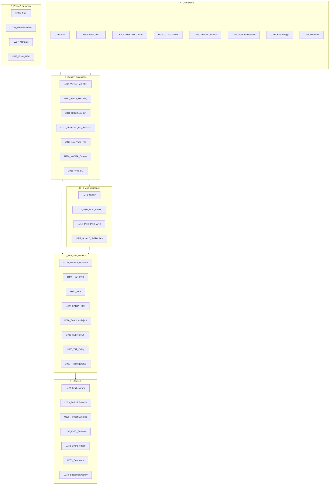
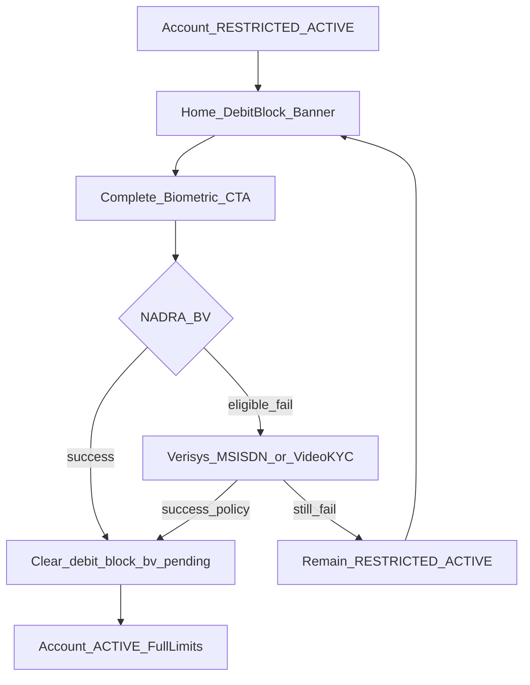
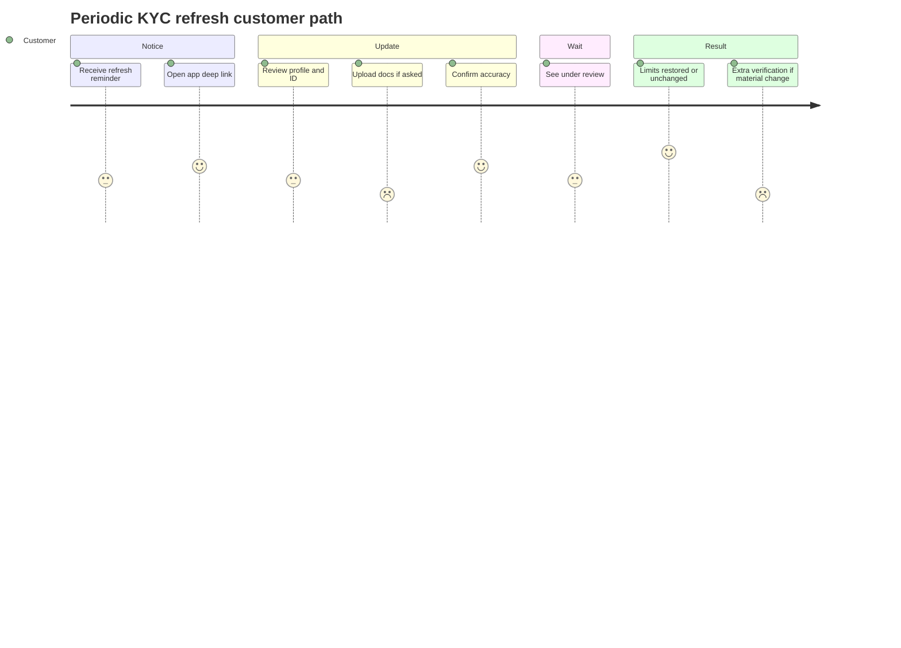
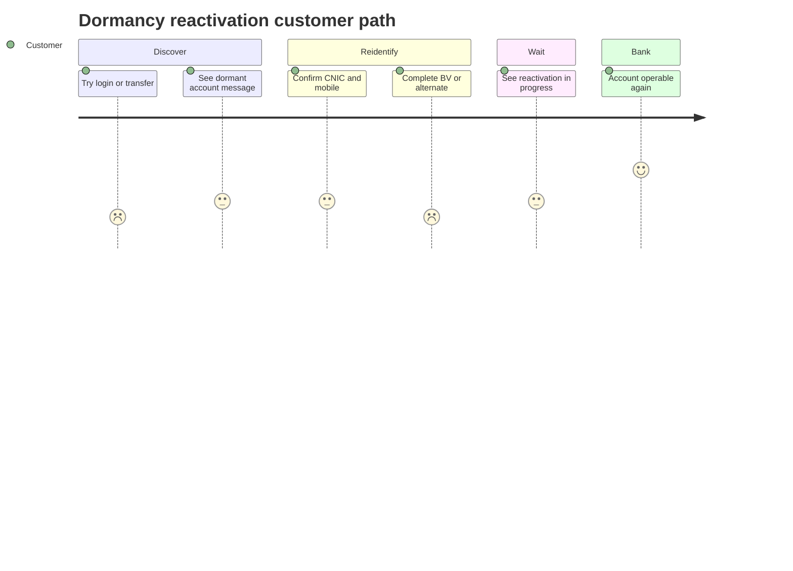

# KYC User Journeys Catalog (Customer-Facing)

> All **customer** journeys for **our** Conventional DRB mobile/web KYC.  
> Screen-by-screen happy path remains in [05a-kyc-user-journey.md](05a-kyc-user-journey.md). This file catalogs **every journey type**.  
> Aligns with [05-recommended-kyc-process.md](05-recommended-kyc-process.md), [08-state-machine.md](08-state-machine.md), Consolidated Customer Onboarding Framework (2025), and AML/CFT/CPF.  
> UX labels are illustrative (**D**); regulatory steps marked **A** where mandatory.  
> Not legal advice. Fictional personas only — no real PII.

**Actors:** customer on app/web only. Ops/compliance queues: [10-aml-risk-edd-ops.md](10-aml-risk-edd-ops.md).  
**Phase 1 depth:** individual retail (all ID types and lifecycle). **Phase 2 summaries:** joint, minor/guardian, mandate, entity/UBO.

Related diagrams:

- Interactive explorer (browser): [05c-kyc-interactive-journeys.html](05c-kyc-interactive-journeys.html)
- All 38 workflows (PDF): [05c-kyc-customer-journeys.pdf](05c-kyc-customer-journeys.pdf)
- Index: [diagrams/16-kyc-journeys-index.mmd](diagrams/16-kyc-journeys-index.mmd)
- Happy-path screens: [diagrams/13-kyc-user-journey.mmd](diagrams/13-kyc-user-journey.mmd), [diagrams/14-kyc-user-journey-screens.mmd](diagrams/14-kyc-user-journey-screens.mmd)
- Refresh / debit-block lift / dormancy: [diagrams/17-kyc-refresh-customer.mmd](diagrams/17-kyc-refresh-customer.mmd), [diagrams/18-debit-block-lift.mmd](diagrams/18-debit-block-lift.mmd), [diagrams/19-dormancy-reactivation.mmd](diagrams/19-dormancy-reactivation.mmd)

---

## How to read a card

Each card: **Trigger** · **Customer sees / does** · **System does** · **State** · **Class** · **Success** · **Error / alternate** · **Primary API** (existing pack APIs only — no invented NADRA payloads).

---

## Journey index

| ID | Family | Journey | Typical persona |
|----|--------|---------|-----------------|
| UJ-01 | A | Happy path STP | Ayesha — salaried, resident CNIC |
| UJ-02 | A | Shared e-KYC prefill | Ayesha — already KYC’d at another bank |
| UJ-03 | A | Expired CNIC + NADRA token | Hamza — ID expired, token in hand |
| UJ-04 | A | OTP fail / lockout / change number | Ayesha — mistypes OTP |
| UJ-05 | A | Decline mandatory consents | Ayesha — refuses NADRA processing |
| UJ-06 | A | Abandon and resume ≤ 30 days | Ayesha — exits at live photo |
| UJ-07 | A | Application expired > 30 days | Ayesha — returns day 31 |
| UJ-08 | A | Customer withdraws | Ayesha — cancels from status screen |
| UJ-09 | B | BV fail → Verisys + MSISDN + OTP | Bilal — unclear fingerprints |
| UJ-10 | B | Senior >60 or disability Verisys | Imran — age 67 |
| UJ-11 | B | Debit-blocked then later BV lift | Bilal — opens restricted, finishes BV later |
| UJ-12 | B | Video KYC as BV fallback | Bilal — a/b fail; no branch |
| UJ-13 | B | Live photo / liveness fail | Ayesha — dark room / mask |
| UJ-14 | B | NADRA timeout / outage | Any — vendor down |
| UJ-15 | B | Web channel BV | Ayesha — starts on web |
| UJ-16 | C | NICOP | Farah — overseas Pakistani, in PK |
| UJ-17 | C | NRP / POC abroad | Farah — applying from abroad |
| UJ-18 | C | POC / POR / ARC | Kamran — eligible non-CNIC ID |
| UJ-19 | C | Annex-B self-declaration SoI | Nadia — student / informal profession |
| UJ-20 | D | Medium risk additional docs | Sana — turnover vs income flag |
| UJ-21 | D | High risk EDD + video interview | Sana — high CRP |
| UJ-22 | D | PEP self-declare or screening match | Sana — family PEP |
| UJ-23 | D | FATCA US person / CRS evidence | Omar — US tax person |
| UJ-24 | D | Sanctions / fraud true match reject | System decline — written reason |
| UJ-25 | D | Duplicate CNIC / existing CIF | Yasmin — already has active account |
| UJ-26 | D | TAT delay beyond 2 WD | Any in review |
| UJ-27 | D | Status by Tracking ID | Any — SMS/web/app |
| UJ-28 | E | Limit / KYC upgrade | Ayesha — wants higher limits |
| UJ-29 | E | Periodic KYC refresh | Ayesha — due by risk interval |
| UJ-30 | E | Refresh overdue restriction | Ayesha — ignored reminders |
| UJ-31 | E | CNIC renewal after token opening | Hamza — 3-month timer |
| UJ-32 | E | Event-driven refresh | Ayesha — ID expiry / product change |
| UJ-33 | E | Dormancy reactivation | Ayesha — no login/txn ~1 year |
| UJ-34 | E | Suspected activity extra verification | Ayesha — TMS step-up |
| UJ-35 | F | Joint account | Phase 2 summary |
| UJ-36 | F | Minor + guardian | Phase 2 summary |
| UJ-37 | F | Mandate / authorized operator | Phase 2 summary |
| UJ-38 | F | Entity / SME + UBO | Phase 2 summary |

---

## A. Acquisition / onboarding core

Screen sequence for UJ-01 is specified in [05a-kyc-user-journey.md](05a-kyc-user-journey.md) Steps 0–14. Cards below state **when** that sequence branches.

### UJ-01 — Happy path STP

| | Detail |
|--|--------|
| Trigger | Customer taps **Open account**; eligible resident CNIC; BV succeeds; screening clear; CRP LOW |
| Customer | Completes OTP → consents → identity → live photo → BV → profile/FATCA/PEP declare → review → submit → **Account approved** → set PIN |
| System | Tracking ID **shown in-app** at start; SMS of that ID after OTP; Table-A capture; NADRA BV; sanctions/PEP; CRP; STP approve; CIF + IBAN |
| State | `INITIATED` → … → `IDENTITY_VERIFIED` → `PROFILE_COMPLETE` → `APPROVED` → `ACCOUNT_PENDING` → `ACTIVE` |
| Class | **A** CDD/BV/TAT; **C** progress bar |
| Success | Full product limits; home dashboard; TMS enrolled |
| Alternate | Any fail → UJ-04…UJ-25 |
| Primary API | `POST /kyc/applications` through `POST .../profile`; `GET .../applications/{id}` |
| QA | J-01 |

### UJ-02 — Shared e-KYC prefill

| | Detail |
|--|--------|
| Trigger | Customer accepts optional Shared e-KYC consent **and** platform is live |
| Customer | Sees **We found your KYC — review details** or **No shared KYC — continue**; edits prefill; still completes live photo + BV policy |
| System | Adapter lookup; prefill editable fields; never skip sanctions/BV; on timeout/miss continue local capture |
| State | `CONSENT_CAPTURED` → `EKYC_PREFILL_APPLIED` (or skip) → `IDENTITY_CAPTURED` |
| Class | **A** when platform operational + consent; refusal must not block local KYC |
| Success | Prefill confirmed; customer remains responsible for accuracy |
| Alternate | Decline e-KYC / miss / error → silent continue to UJ-01 identity form |
| Primary API | `POST .../consents`; e-KYC adapter behind KYC Service (no proprietary payload in app) |

### UJ-03 — Expired CNIC + NADRA token

| | Detail |
|--|--------|
| Trigger | Customer enters expired CNIC and has NADRA renewal receipt/token |
| Customer | Prompted to capture **expired ID + token/receipt**; helper text: renewed ID required within **3 months** |
| System | Accepts token path; starts renewal timer; flags `document_pending` / remediation schedule |
| State | Identity captured with expiry exception; may still reach `ACTIVE` or `RESTRICTED_ACTIVE` |
| Class | **A** (Consolidated: open on token; obtain renewed ID within 3 months) |
| Success | Application continues; countdown/reminder enrolled (handoff UJ-31) |
| Alternate | No token → cannot proceed on expired ID |
| Primary API | `POST .../identity`; document upload for token artefact |
| QA | J-04 |

### UJ-04 — OTP fail / lockout / change number

| | Detail |
|--|--------|
| Trigger | Wrong OTP, expiry, or customer wants a different mobile |
| Customer | Retry OTP; after N fails sees cool-down timer; optional **change number** (new attempt rules explained) |
| System | Attempt limits; no OTP in logs; does **not** skip to `CONTACT_VERIFIED` |
| State | Remains `INITIATED` until confirm succeeds |
| Class | **A**/tier (MSISDN); **B/C** OTP security |
| Success | Mobile verified → `CONTACT_VERIFIED` |
| Alternate | Cool-down; support via Tracking ID (UJ-27) |
| Primary API | `POST .../contact/verify/start` & `/confirm` |
| QA | J-02 |

### UJ-05 — Decline mandatory consents

| | Detail |
|--|--------|
| Trigger | Customer refuses T&Cs, privacy, KFS, or NADRA/BV processing |
| Customer | Continue disabled; optional **Save draft and exit**; marketing toggle stays independent (off by default) |
| System | Versioned consents; block until all mandatory accepted |
| State | `CONTACT_VERIFIED` (no `CONSENT_CAPTURED`) |
| Class | **A/B** |
| Success | Mandatory accepted → `CONSENT_CAPTURED` |
| Alternate | Exit with draft (UJ-06) or withdraw (UJ-08) |
| Primary API | `POST .../consents` |
| QA | J-03 |

### UJ-06 — Abandon and resume ≤ 30 days

| | Detail |
|--|--------|
| Trigger | Customer exits mid-flow (or kills app) |
| Customer | Returns via app deep link / Tracking ID; lands on **last incomplete step** |
| System | Persists draft; 30-day resume window (**A**) |
| State | Last successful state unchanged |
| Class | **A** session resume |
| Success | Continues without re-collecting completed steps (re-auth OTP if policy) |
| Alternate | Day 31 → UJ-07 |
| Primary API | `GET /kyc/applications/{id}` or `GET .../tracking/{trackingId}` |
| QA | J-10 |

### UJ-07 — Application expired > 30 days

| | Detail |
|--|--------|
| Trigger | Resume window exceeded |
| Customer | Sees **Application expired — start a new one**; old Tracking ID shown for support only |
| System | `EXPIRED`; new `POST /kyc/applications` required |
| State | `EXPIRED` (terminal for that application) |
| Class | **A** 30-day resume |
| Success | New application `INITIATED` |
| Alternate | Support explains no silent reuse of old evidence beyond policy |
| Primary API | `GET .../tracking/{trackingId}` then `POST /kyc/applications` |
| QA | J-11 |

### UJ-08 — Customer withdraws

| | Detail |
|--|--------|
| Trigger | Customer chooses **Cancel application** from status or support-linked screen |
| Customer | Confirms withdrawal; sees confirmation + support contact |
| System | Marks withdrawn; stops TAT clock; does not open CIF |
| State | `WITHDRAWN` |
| Class | **D** UX; audit **A/B** |
| Success | No account; can start a new application per fraud/dedupe rules |
| Alternate | Accidental cancel → support cannot reopen same ID; start new |

---

## B. Identity verification exceptions (SBP §F ladder)

Primary: NADRA BV. Eligible failure: Verisys + CNIC–MSISDN + OTP/callback. If that fails: debit block **or** recorded video KYC + Verisys (digital bank without branches). Face-to-face branch guide does not apply unless a partner-reliance channel exists.

### UJ-09 — BV fail → Verisys + MSISDN + OTP

| | Detail |
|--|--------|
| Trigger | Live photo OK; BV fails for an **eligible** reason (unclear prints, etc.) |
| Customer | **We’ll verify another way**; confirms mobile ownership; OTP or callback |
| System | Verisys + CNIC–MSISDN pairing; persist vendor refs not raw templates |
| State | `IDENTITY_VERIFICATION_IN_PROGRESS` → `IDENTITY_VERIFIED` (alternate assurance) |
| Class | **A** §F.1.v.b |
| Success | Identity verified; may still be full ACTIVE if policy allows |
| Alternate | Still fail → UJ-11 and/or UJ-12 |
| Primary API | `POST .../identity/verify`; `POST .../biometric/verify` |
| QA | J-06 |

### UJ-10 — Senior >60 or disability / unclear fingerprints

| | Detail |
|--|--------|
| Trigger | DOB shows age **>60**, or declared/observed permanent physical disability / unclear fingerprints |
| Customer | Offered Verisys path **without** forcing repeated finger BV; still live photo |
| System | Eligible-reason flag; Verisys + MSISDN tier; record reason BV not met |
| State | Same as UJ-09 |
| Class | **A** Verisys alternate allowed for seniors >60 and disability |
| Success | Verified without punitive retry loops |
| Alternate | If Verisys also fails → UJ-11 / UJ-12 |

### UJ-11 — Debit-blocked account then later BV lift

| | Detail |
|--|--------|
| Trigger | Tiers a/b not completed; policy opens account with **debit block** |
| Customer | **Account opened — debit blocked until biometric complete** + persistent banner + CTA; credits may be allowed per product policy |
| System | `RESTRICTED_ACTIVE` + flags `debit_block`, `bv_pending`; later BV success clears flags |
| State | `APPROVED` → `ACCOUNT_PENDING` → `RESTRICTED_ACTIVE` → (after BV) `ACTIVE` |
| Class | **A** §F.1.v.c; messaging must be explicit (**A/B**) |
| Success | Banner gone; full limits per product |
| Alternate | Still cannot BV → video KYC (UJ-12) or remain restricted |
| Primary API | `POST .../biometric/verify`; `GET .../applications/{id}` (restrictionFlags) |
| QA | J-07 |

### UJ-12 — Video KYC as BV fallback (no branch)

| | Detail |
|--|--------|
| Trigger | Digital bank without physical presence; BV and Verisys+MSISDN not completed |
| Customer | Books recorded **video KYC**; joins session; follows agent script; waits for decision |
| System | Session + recording retained; NADRA Verisys; record reasons BV not met; case |
| State | `VIDEO_KYC_PENDING` → `IDENTITY_VERIFIED` or `REJECTED` / remain restricted |
| Class | **A** §F.1.v.f / §G |
| Success | Identity verified; account ACTIVE or RESTRICTED per flags |
| Alternate | No-show / poor recording → reschedule; third-party reliance only if product enables it |
| Primary API | `POST /kyc/applications/{id}/video-kyc/sessions` |
| QA | J-08 (also EDD video) |

### UJ-13 — Live photo / liveness fail

| | Detail |
|--|--------|
| Trigger | Face not in frame, mismatch to ID portrait, or liveness fail |
| Customer | Guidance (light, no mask); retry N times; then **schedule video** or support |
| System | Encrypted realtime upload; **no photo left on device**; face match (**B/C**); liveness **B/C** — **not** a substitute for NADRA BV |
| State | Remains `IDENTITY_CAPTURED` until `LIVE_PHOTO_CAPTURED` |
| Class | **A** live photo; **B/C** match/liveness |
| Success | Live photo accepted → BV step |
| Alternate | Max retries → UJ-12 or reject per fraud policy |
| Primary API | `POST .../live-photo` |

### UJ-14 — NADRA timeout / outage

| | Detail |
|--|--------|
| Trigger | NADRA/vendor timeout or 503 |
| Customer | **Verification taking longer** + Tracking ID; retry CTA; no fake “approved” |
| System | Stay `IDENTITY_VERIFICATION_IN_PROGRESS`; retry/backoff; after max → alternate tier or case; **do not STP approve** |
| State | `IDENTITY_VERIFICATION_IN_PROGRESS` (hold) |
| Class | **A** fail-controlled on BV; **B** fail closed on screening (see UJ-24) |
| Success | Vendor recovers → continue UJ-01 or UJ-09 |
| Alternate | Customer can resume later (UJ-06) |
| Primary API | `POST .../identity/verify` (`503` → retry guidance) |

### UJ-15 — Web channel: webcam or push-to-app for BV

| | Detail |
|--|--------|
| Trigger | Customer starts on web/portal instead of mobile app |
| Customer | Same steps as UJ-01; BV via webcam/vendor widget **or** **Continue in app** push for fingerprint/face SDK |
| System | `channel` = WEB; geo/IP captured; same state machine |
| State | Same as mobile |
| Class | **A** website/portal is an allowed remote medium |
| Success | Same outcomes as mobile |
| Alternate | If webcam cannot complete BV → push-to-app or UJ-09/UJ-12 |

---

## C. ID type and residency variants

Digital onboarding only for **CNIC / NICOP / POC / POR / ARC**. Ineligible types are blocked before capture.

### UJ-16 — NICOP (overseas Pakistani)

| | Detail |
|--|--------|
| Trigger | Customer selects NICOP (in Pakistan or as NRP — if abroad see UJ-17) |
| Customer | Enters NICOP number, issue/expiry; live photo; BV if service available |
| System | Eligible ID validation; Table-A; FATCA/CRS residency often NRP-capable |
| State | Same spine as UJ-01 |
| Class | **A** eligible digital ID |
| Success | Account per product (LCY/FCY as offered) |
| Alternate | BV unavailable abroad → UJ-17 |

### UJ-17 — NRP / POC abroad (Verisys until BV available)

| | Detail |
|--|--------|
| Trigger | Residency NRP and/or POC holder applying **outside Pakistan**; NADRA BV service not available |
| Customer | Told BV will follow when available; completes Verisys path; live photo still required for digital |
| System | Verisys alternate (framework exception for NRP/POC abroad); record geo/IP |
| State | `IDENTITY_VERIFIED` at Verisys assurance; possible restriction flags per policy |
| Class | **A** Verisys allowed until BV service available |
| Success | Relationship established without pretending BV succeeded |
| Alternate | When BV becomes available → treat as upgrade/remediation (UJ-28 / UJ-32) |

### UJ-18 — POC / POR / ARC

| | Detail |
|--|--------|
| Trigger | Customer holds POC, POR, or ARC (not CNIC/NICOP) |
| Customer | Selects ID type; enters number/dates; live photo; BV (or eligible alternate) |
| System | ID-type allow-list; nationality/residency fields; screening of customer |
| State | Same spine |
| Class | **A** eligible digital IDs per AML definitions + Consolidated |
| Success | Verified identity; product eligibility per bank policy |
| Alternate | Ineligible ID (e.g. passport-only foreign national without ARC) → stop with reason |

### UJ-19 — Annex-B self-declaration SoI vs documents

| | Detail |
|--|--------|
| Trigger | Profession where formal docs uncommon **and** CRP low **and** expected turnover below policy threshold (student, housewife, farmer, labor, etc.) |
| Customer | Self-declaration; fund-provider name, ID, relationship if funds from another person; **or** upload salary/business docs if not eligible |
| System | Document policy engine; do not hardcode “always salary slip” |
| State | Toward `PROFILE_COMPLETE` |
| Class | **A** risk-based Annex-B |
| Success | Profile complete; STP still only if screening/risk allow |
| Alternate | High turnover / medium-high risk → require docs (UJ-20) |

---

## D. Risk, documents, and decision (customer experience)

Customer does not see maker-checker. They see wait, upload, video booking, approve, restrict, or written decline.

### UJ-20 — Medium risk: additional documents / wait

| | Detail |
|--|--------|
| Trigger | CRP MEDIUM or documentary gaps after submit |
| Customer | Checklist of missing docs; upload UI; status **More information needed**; TAT pause/comms |
| System | `ADDITIONAL_INFORMATION_REQUIRED`; clock rules; re-enter screening/risk after submit |
| State | `RISK_ASSESSMENT_IN_PROGRESS` → `ADDITIONAL_INFORMATION_REQUIRED` → `PROFILE_COMPLETE` (re-run) |
| Class | **A** TAT communication; **A** CDD completeness |
| Success | Docs accepted → approve or EDD |
| Alternate | No upload in window → reminders; eventual expire/restrict per policy |
| Primary API | `POST .../profile` / document upload; `GET .../applications/{id}` |

### UJ-21 — High risk EDD + recorded video interview

| | Detail |
|--|--------|
| Trigger | CRP HIGH and/or policy EDD (complex profile, SoW/SoF) |
| Customer | **Additional verification needed**; upload SoI/SoW; book **recorded video KYC interview**; wait for decision |
| System | EDD case; video retained; enhanced monitoring flag if approved |
| State | `EDD_REQUIRED` / `MANUAL_REVIEW` / `VIDEO_KYC_PENDING` → `APPROVED` or `REJECTED` |
| Class | **A** EDD; **A** recorded video for non-face-to-face EDD (§G) |
| Success | Approved with monitoring **or** reject with written reason |
| Alternate | Missed interview → reschedule; TAT delay → UJ-26 |
| QA | J-08 |

### UJ-22 — PEP self-declare or screening match

| | Detail |
|--|--------|
| Trigger | Customer answers yes to PEP/family/associate **or** independent PEP screen hits |
| Customer | Honest PEP questions at profile; then ** Extra checks in progress**; may be asked SoW/SoF and video (UJ-21) |
| System | Store declaration **and** independent PEP screen; senior approval is ops-side — customer only waits |
| State | `SCREENING_HIT_REVIEW` and/or `EDD_REQUIRED` |
| Class | **A** PEP controls + declaration UX **B/D** |
| Success | Approved with enhanced monitoring or declined in writing |
| Alternate | False-positive cleared — customer sees approved without extra docs if policy allows |

### UJ-23 — FATCA US person / CRS extra evidence

| | Detail |
|--|--------|
| Trigger | US person / additional tax residency / other nationality declared |
| Customer | Tax residency UI; uploads evidence if non-resident tax; W-form analogue per bank tax ops (**D**) |
| System | Store tax profile; may route EDD |
| State | Profile/tax complete; possible `EDD_REQUIRED` |
| Class | **A** Table-A FATCA/CRS |
| Success | Tax profile stored; onboarding continues |
| Alternate | Refusal to declare → cannot complete profile |

### UJ-24 — Sanctions / fraud true match reject

| | Detail |
|--|--------|
| Trigger | Confirmed UNSC/ATA hit after adjudication policy, or fraud lock |
| Customer | Application **rejected**; **specific written reason** (legal-approved wording); support contact; no STP retry for sanctions true match |
| System | Fail closed; audit; no CIF |
| State | `REJECTED` |
| Class | **A** TFS; **A** written decline |
| Success | Customer understands outcome; support channel available |
| Alternate | Potential hit first → customer waits (status “under review”) until adjudication |
| QA | J-09 |

### UJ-25 — Duplicate CNIC / existing CIF

| | Detail |
|--|--------|
| Trigger | CNIC hash matches active customer uniqueness key |
| Customer | Clear message: **You already have an account** (or recovery/login) — not a vague reject |
| System | Block/case; `identity_uniqueness_keys` |
| State | Stay pre-verify or `REJECTED` / redirect to login per policy |
| Class | **A/B** no duplicate fictitious; **C** fraud |
| Success | Login to existing CIF or support-led merge per ops (customer sees support) |
| Alternate | Closed/old CIF — product policy for reopen vs new app |
| QA | J-12 |

### UJ-26 — TAT delay notification (beyond 2 WD)

| | Detail |
|--|--------|
| Trigger | Individual decision not issued within **2 working days** of complete application |
| Customer | Push/SMS/email: still in review, Tracking ID, support; not a silent stall |
| System | SLA breach queue (ops); customer comms |
| State | Unchanged (`MANUAL_REVIEW` / `EDD_REQUIRED` / etc.) |
| Class | **A** TAT 2 WD individuals; **A** 24/7 support |
| Success | Customer can track (UJ-27) until decision |
| Alternate | Entity TAT 5 WD is Phase 2 (UJ-38) |

### UJ-27 — Status tracking by Tracking ID

| | Detail |
|--|--------|
| Trigger | Any in-flight or decided application. Tracking ID is on-screen from Step 0; SMS after OTP success; email if captured |
| Customer | Enters Tracking ID in app/web; sees non-sensitive progress, next step, restrictions |
| System | Rate-limited public-ish status; no excess PII |
| State | Current |
| Class | **A** tracking ID + status |
| Success | Customer knows what to do next |
| Alternate | Unknown ID → generic error (no enumeration) |
| Primary API | `GET /kyc/applications/tracking/{trackingId}` |

---

## E. Post-activation lifecycle

### UJ-28 — Limit / KYC upgrade

| | Detail |
|--|--------|
| Trigger | Customer requests higher limits / product upgrade from home |
| Customer | Upload SoI/SoF docs; re-BV if assurance insufficient; wait for decision |
| System | May spawn refresh-like application; re-screen; update limits |
| State | `ACTIVE` (or `RESTRICTED_ACTIVE`) → refresh/remediation subflow → `ACTIVE` with new limits |
| Class | **A** ongoing CDD when activity/limits change; **D** product thresholds |
| Success | New limit banner; debit block lifted if that was the gate |
| Alternate | Insufficient evidence → remain on current limits |

### UJ-29 — Periodic KYC refresh

| | Detail |
|--|--------|
| Trigger | Scheduler by risk-rating interval (`kyc_refresh_schedules`) |
| Customer | Push/SMS **Update your KYC**; reviews profile/ID; confirms; uploads if asked |
| System | `REFRESH_DUE`; fresh screening + CRP; material change → EDD (UJ-21) |
| State | `ACTIVE` → `REFRESH_DUE` → `ACTIVE` (or `REMEDIATION`) |
| Class | **A** ongoing CDD; interval policy **B** |
| Success | Next due date set; account uninterrupted if completed on time |
| Alternate | Ignore → UJ-30 |
| Primary API | `POST /kyc/customers/{customerId}/refresh` |

### UJ-30 — Refresh overdue → restriction messaging

| | Detail |
|--|--------|
| Trigger | Refresh not completed beyond policy grace |
| Customer | Explicit restriction/freeze messaging (not silent); CTA to complete refresh |
| System | Restrict debit / freeze per AML policy; notify |
| State | `REFRESH_DUE` / `REMEDIATION` + restriction flags |
| Class | **A** ongoing CDD enforcement |
| Success | Completing UJ-29 lifts restriction |
| Alternate | Continued non-response → dormancy/closure per product (Legal) |

### UJ-31 — CNIC renewal after token opening

| | Detail |
|--|--------|
| Trigger | Account opened under UJ-03; approaching **3 months** |
| Customer | Reminders; captures renewed CNIC (photo/OCR confirm); may re-BV |
| System | Timer; `REMEDIATION` if overdue |
| State | `ACTIVE`/`RESTRICTED_ACTIVE` → `REMEDIATION` if late → back to operable |
| Class | **A** obtain renewed ID within 3 months |
| Success | Identity expiry updated |
| Alternate | No renewed ID → restrict per policy |

### UJ-32 — Event-driven refresh

| | Detail |
|--|--------|
| Trigger | CNIC expiry, adverse screening hit, channel fraud event, or product upgrade — not the calendar interval |
| Customer | Same UX as UJ-29 but copy explains **why** (ID expired / security / product) |
| System | Event opens refresh; re-screen; possibly EDD |
| State | `REFRESH_DUE` / `REMEDIATION` |
| Class | **A/B** ongoing monitoring |
| Success | Profile current; risk updated |
| Alternate | Overdue → UJ-30 |

### UJ-33 — Dormancy reactivation

| | Detail |
|--|--------|
| Trigger | No customer-initiated txn **or** digital login for preceding one year (AML dormant/inoperative definition — confirm current text) |
| Customer | Blocked or warned; completes re-identification / re-verification |
| System | Reactivation CDD; screening; may require BV |
| State | Dormant account flag → operable after verification |
| Class | **A** AML reactivation identification/verification |
| Success | Login and payments work again |
| Alternate | Cannot re-verify → remain dormant; support |

### UJ-34 — Suspected activity extra verification

| | Detail |
|--|--------|
| Trigger | TMS / fraud step-up (device change, atypical transfer) |
| Customer | Extra OTP, BV, or live photo; **temporary restriction** banner if applied |
| System | Step-up auth; possible temporary `debit_block`; case if needed |
| State | `ACTIVE` with orthogonal restriction flags (not always a KYC state change) |
| Class | **A** impersonation/fraud controls; **B/C** device binding |
| Success | Restriction lifted after verification |
| Alternate | Fail → remain restricted; support; possible STR (ops, not shown to customer) |

---

## F. Phase 2 customer journeys (summary only)

Not v1 screen specs. Data hooks already exist (`kyc_application_parties`, `entities`, `beneficial_owners`). Product policy + Legal before build.

### UJ-35 — Joint account (both parties CDD)

| | Detail |
|--|--------|
| Trigger | Customer chooses joint savings/current |
| Customer | Primary completes UJ-01 spine; **invitee** receives link; second party repeats identity/BV/consents/screening |
| System | `kyc_application_parties`; screen **each** associated person; relationship not active until all parties pass |
| State | Per-party verification; application APPROVED only when all required parties `IDENTITY_VERIFIED` + screening clear |
| Class | **A** CDD each customer; **A** sanctions each associated person |
| Success | Joint CIF/account; both can operate per mandate |
| Alternate | One party fails/rejects → application cannot activate as joint |
| Note | v1 is primarily primary-party; this is Phase 2 UX |

### UJ-36 — Minor + guardian (Form-B / Juvenile)

| | Detail |
|--|--------|
| Trigger | Product allows minor; guardian opens on behalf |
| Customer | Guardian KYC (adult ID + BV); minor identity via **Form-B / Juvenile** per AML ID types; purpose/SoF of funds |
| System | Party role `guardian`; screen guardian and (policy) minor identifiers; no anonymous accounts |
| TAT | Individual 2 WD unless Legal classifies otherwise |
| Class | **A** identify/verify customer; product eligibility **D** |
| Success | Minor account with guardian operating mandate |
| Alternate | Digital channel may be **out of scope** if Form-B is not an eligible **digital** ID (Consolidated digital list is CNIC/NICOP/POC/POR/ARC) — confirm with Compliance; may require assisted/Phase 2 channel |
| Note | Do not assume remote-only minor opening is allowed |

### UJ-37 — Mandate / authorized operator

| | Detail |
|--|--------|
| Trigger | Existing customer adds an authorized operator (or opens with mandate) |
| Customer | Primary confirms; operator completes own identity/BV/consents |
| System | Party role mandate; screen operator; limits on operator actions |
| Class | **A** CDD on persons acting; **A** associated-person screening |
| Success | Operator can transact within mandate |
| Alternate | Operator sanctions/PEP → block mandate, not necessarily close primary |

### UJ-38 — Entity / SME + UBO

| | Detail |
|--|--------|
| Trigger | Business account (Phase 2 / P6) |
| Customer | Entity intake (incorporation docs, addresses); each UBO/controller identified and verified; consents; wait up to **5 working days** |
| System | `entities`, `entity_parties`, `beneficial_owners`; ownership 20% generally / 10% EDD contexts — **confirm latest AML + Consolidated with Legal**; EDD for complex ownership |
| State | Entity application machine (not fully specified in v1 individual SM) |
| Class | **A** beneficial ownership; **A** entity TAT 5 WD |
| Success | Entity CIF + account; UBOs stored |
| Alternate | Incomplete UBO → additional info; sanctions on BO → reject |
| Note | [13-implementation-gaps-references.md](13-implementation-gaps-references.md) G11 / P6 |

---

## Cross-cutting customer rules

1. Show **Tracking ID** in-app from start, and on status, approve, restrict, and decline (**A**). SMS after verified mobile; email if collected — not at Step 0.  
2. Debit-block and refresh-restriction copy must be explicit — never a silent limited account.  
3. Decline reasons specific (**A**).  
4. Resume ≤ 30 days (**A**); after that new application.  
5. No KYC images/data retained on device after upload (**A**).  
6. Selfie/liveness does **not** replace NADRA BV.  
7. EN/UR for legal and verification screens (**C/D**).  
8. 24/7 support path from every terminal/wait screen (**A**).

---

## Mapping: catalog → API / state (customer)

| Journey | Primary API | Typical state after success |
|---------|-------------|------------------------------|
| UJ-01 start | `POST /kyc/applications` | `INITIATED` |
| UJ-04 | contact verify start/confirm | `CONTACT_VERIFIED` |
| UJ-05 | `POST .../consents` | `CONSENT_CAPTURED` |
| UJ-02 | consents + e-KYC adapter | `EKYC_PREFILL_APPLIED` or skip |
| Identity | `POST .../identity` | `IDENTITY_CAPTURED` |
| UJ-13 | `POST .../live-photo` | `LIVE_PHOTO_CAPTURED` |
| UJ-09 / UJ-10 / BV | `POST .../identity/verify`, `POST .../biometric/verify` | `IDENTITY_VERIFIED` |
| UJ-12 / UJ-21 video | `POST .../video-kyc/sessions` | `VIDEO_KYC_PENDING` → verified |
| Profile / UJ-19 / UJ-23 | `POST .../profile` | `PROFILE_COMPLETE` |
| UJ-27 | `GET .../applications/{id}` or `GET .../tracking/{trackingId}` | current |
| UJ-11 flags | `GET .../applications/{id}` `restrictionFlags` | `RESTRICTED_ACTIVE` → `ACTIVE` |
| UJ-28 / UJ-29 / UJ-32 | `POST /kyc/customers/{id}/refresh` | `REFRESH_DUE`… |

---

## QA test scenarios (catalog extension)

Scenarios J-01–J-12 live in [05a-kyc-user-journey.md](05a-kyc-user-journey.md). Additional catalog coverage:

| ID | Journey | Scenario | Expected |
|----|---------|----------|----------|
| J-13 | UJ-02 | e-KYC hit + consent | Prefill; BV/sanctions still run |
| J-14 | UJ-02 | e-KYC timeout | Continue local identity; no hard fail |
| J-15 | UJ-08 | Customer cancel | `WITHDRAWN`; no CIF |
| J-16 | UJ-10 | Age >60 | Verisys offered; no endless finger retries |
| J-17 | UJ-11 | Later BV success | `debit_block` cleared; `ACTIVE` |
| J-18 | UJ-13 | Live photo max retries | Video or stop; no BV skip |
| J-19 | UJ-14 | NADRA 503 | Stay IN_PROGRESS; no APPROVE |
| J-20 | UJ-15 | Web start + push-to-app BV | Same application ID; `IDENTITY_VERIFIED` |
| J-21 | UJ-17 | NRP abroad | Verisys path; BV not faked |
| J-22 | UJ-18 | Ineligible ID type | Block before capture |
| J-23 | UJ-19 | Low-risk student self-declare | Profile complete without salary slip |
| J-24 | UJ-20 | Medium risk checklist | `ADDITIONAL_INFORMATION_REQUIRED`; upload resumes |
| J-25 | UJ-22 | PEP yes | Wait/EDD; not STP |
| J-26 | UJ-23 | US person | Extra tax evidence required |
| J-27 | UJ-26 | Day 3 no decision | Customer notified; Tracking ID |
| J-28 | UJ-28 | Limit upgrade | Docs + re-BV; new limits |
| J-29 | UJ-29 | Refresh on time | Next due updated; no restriction |
| J-30 | UJ-30 | Refresh overdue | Explicit restriction + CTA |
| J-31 | UJ-31 | Token month 3 | Reminder; remediation if skipped |
| J-32 | UJ-33 | Dormant login | Re-BV/re-ID then operable |
| J-33 | UJ-34 | Device step-up | Extra verify; restriction lifts |
| J-34 | UJ-35 | Phase 2 joint | Both parties screened (when built) |
| J-35 | UJ-38 | Phase 2 entity | TAT 5 WD; UBO captured (when built) |

---

## Handoffs

| From catalog | To document |
|--------------|-------------|
| Screen-level onboarding (UJ-01 steps) | [05a-kyc-user-journey.md](05a-kyc-user-journey.md) |
| Process / decision policy | [05-recommended-kyc-process.md](05-recommended-kyc-process.md) |
| ID types, §F ladder, TAT, Annex-B | [02-sbp-kyc-cdd-framework.md](02-sbp-kyc-cdd-framework.md) |
| Shared e-KYC consent model | [03-shared-ekyc-platform.md](03-shared-ekyc-platform.md) |
| States / events / restriction flags | [08-state-machine.md](08-state-machine.md) |
| APIs | [09-api-specification.md](09-api-specification.md) |
| Refresh, EDD, dormancy, queues | [10-aml-risk-edd-ops.md](10-aml-risk-edd-ops.md) |
| Phase 2 entity gap | [13-implementation-gaps-references.md](13-implementation-gaps-references.md) |
