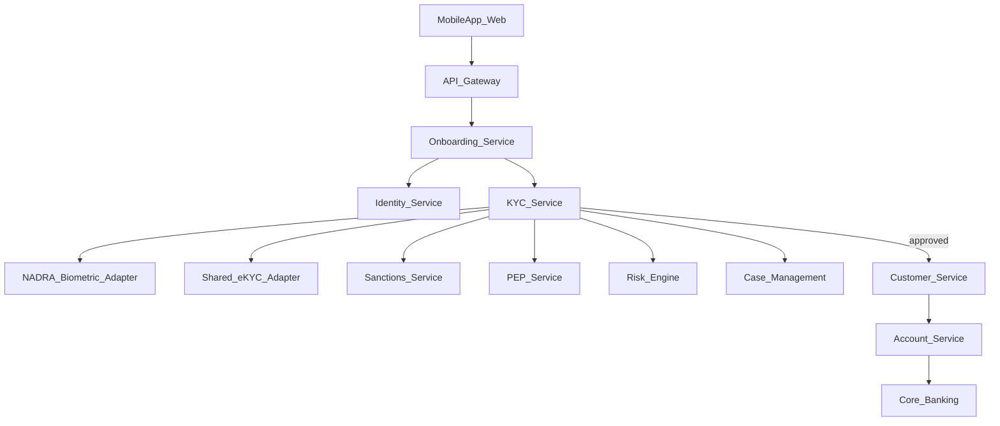

# 12. KYC Microservice Architecture

> Conventional DRB, event-driven microservices. Adapters hide vendor/NADRA/e-KYC proprietary contracts.  
> Diagram: [diagrams/03-microservice-architecture.mmd](diagrams/03-microservice-architecture.mmd).

---

## Context diagram



```text
API Gateway → Onboarding → Identity + KYC
KYC → NADRA Adapter, e-KYC Adapter, Sanctions, PEP, Risk, Cases, Docs, Consent, Audit
KYC approve → Customer → Account → Core Banking
Event Bus → TMS, Notification, Fraud
```

---

## Service responsibilities

| Service | Responsibility | Owns data (logical) | Does not do |
|---------|----------------|---------------------|-------------|
| **API Gateway** | mTLS/TLS termination, OAuth2/OIDC, rate limits, routing, request IDs | — | Business decisions |
| **Onboarding Service** | Application lifecycle orchestration, tracking ID, TAT timers, resume, step routing | Application orchestration projections | Final KYC approve |
| **KYC Service** | **Source of truth for KYC state machine**, decisions, status history | `kyc_applications`, status, decisions | Core ledger posting |
| **Identity Service** | Identity attributes, ID docs metadata, verification references | `customer_identities`, verification refs | Screening |
| **Biometric / NADRA Adapter** | Vendor-agnostic BV/Verisys/MSISDN pairing calls; map errors to domain | Attempt logs (tokenized) | Store raw biometrics long-term if avoidable |
| **Shared e-KYC Adapter** | Consent-gated fetch/publish; circuit breaker | ekyc refs | Replace local CDD |
| **AML Screening Service** | Orchestrates list screening requests | — | Owns list vendor alone |
| **Sanctions Screening Service** | UNSC/ATA/TFS screening | `screening_results` type SANCTIONS | Account open |
| **PEP Screening Service** | PEP/family/close associate determination support | `screening_results` type PEP | Senior approval workflow alone |
| **Risk Engine** | CRP scoring, EDD triggers, limit recommendations | `customer_risk_*` | Hard sanctions reject (screening owns) |
| **Case Management** | Manual review, EDD, maker-checker, SLA | `kyc_cases`, reviews | STP path |
| **Customer Service** | CIF / customer master after KYC approve | `customers`, contacts, addresses | KYC state |
| **Account Service** | Product accounts, status, limits, debit blocks | account projections | NADRA |
| **Core Banking** | Authoritative balances, IBAN, postings | Core ledgers | UX onboarding |
| **Document Management** | Encrypted docs, live photo objects, retention | object store + `kyc_documents` | Decisioning |
| **Consent Service** | Versioned consents & revocation | `kyc_consents` | |
| **Notification Service** | SMS/email/push OTP & status | templates | |
| **Audit Service** | Append-only audit; tamper evidence | `kyc_audit_logs` | Mutate KYC |
| **Transaction Monitoring** | Post-account TMS, typology rules | alerts | Onboarding STP |
| **Fraud / Device Service** | Device binding, duplicate heuristics | `device_bindings`, fraud signals | Legal CDD alone |
| **Event Bus** | Async integration, idempotent consumers | topics | |

---

## Sync vs async

| Interaction | Mode | Rationale |
|-------------|------|-----------|
| OTP send/verify | Sync | UX |
| NADRA BV | Sync with timeout + async callback option | Vendor variability |
| Sanctions/PEP | Sync for onboarding gate; async re-screen | Must block before activate |
| Risk score | Sync | Decision path |
| CIF/Account create | Sync command + async confirmation events | Consistency |
| e-KYC fetch | Sync short timeout; fail to local | Resilience |
| Audit | Async fire-and-complete with guaranteed delivery | Latency |
| TMS | Async post-activation | |

---

## Event bus (selected domain events)

See [appendices/E-event-catalog.md](appendices/E-event-catalog.md).

Examples:

- `onboarding.application.started`  
- `kyc.consent.captured`  
- `kyc.verification.completed`  
- `kyc.screening.completed`  
- `kyc.risk.assessed`  
- `kyc.decision.approved` / `rejected`  
- `customer.cif.created`  
- `account.opened` / `account.debit_blocked`  
- `kyc.case.opened` / `resolved`  
- `kyc.refresh.due`  

Consumers must be **idempotent** (use `event_id` / `idempotency_key`).

---

## Deployment & tenancy notes

- Separate network segments: DMZ (gateway), app, data, vendor connectivity  
- Secrets via vault; no NADRA credentials in code  
- PII databases encrypted; field-level encryption for CNIC, biometrics tokens  
- Maker-checker console on separate admin IdP with step-up MFA  

---

## Mapping to user brief services

All services requested in the brief are covered above. **AML Service** can be a façade over Sanctions + PEP + internal watchlist + adverse media connectors if team prefers one bounded context initially; split when scaling.
