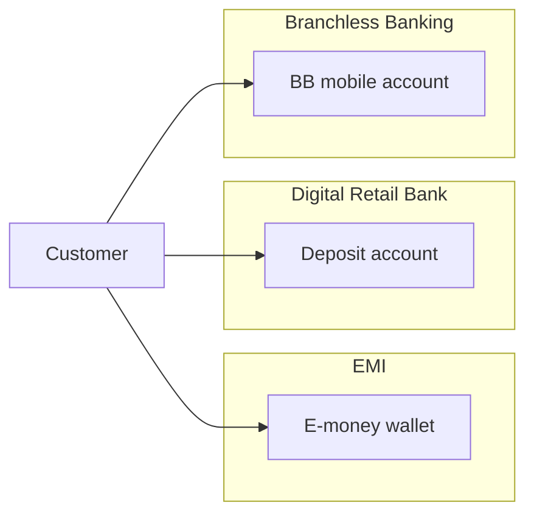

# 2–4. Pakistan EMI Regulatory Landscape & Licensed Institutions

> Research cut-off: September 2026. Prefer SBP primary sources. Statuses change — re-verify before board or build decisions. Not legal advice.

## 2. Regulatory landscape

### 2.1 What an EMI is (and is not)

| Item | Detail |
|------|--------|
| Statute | Payment Systems and Electronic Fund Transfers Act, 2007 (PS&EFT Act) |
| Instrument | Regulations for Electronic Money Institutions (EMIs) |
| Issued | 1 April 2019 |
| Revised | **21 June 2023** — PSP&OD Circular No. 03 of 2023 |
| PDF | https://www.sbp.org.pk/assets/documents/circulars/psd/2023/C3-Enclosure-Regulations-EMIs.pdf |
| Circular page | https://www.sbp.org.pk/psd/2023/C3.htm |
| Supervisor | Payment Systems Policy & Oversight Department (PSP&OD), SBP |
| Legal form | **Non-banking** entity authorised to issue **e-money** |

**E-money (PS&EFT Act / EMI Regulations):** monetary value stored on an electronic/magnetic device or payment instrument, issued on receipt of funds of not less value than the monetary value issued, accepted as a means of payment by undertakings **other than the issuer**. The holder has a **claim on the EMI**.

**Explicit prohibitions (**A** — EMI Regulations §7):**

- Conduct the **business of banking**, including accepting funds from the public **for lending**.  
- Investments other than those allowed for **safeguarding** customer funds (§16).  
- Virtual currencies / prohibited speculative activity.  
- Pay **interest/returns** or anything that adds to the monetary value of e-money because it is held (discounts on goods/services OK if **not** linked to amount or time held).  
- Issue e-money **at a discount** (instrument value > funds received).

### 2.2 Licensing stages (**A**)

Under PS&EFT Act §24 and EMI Regulations §8:

```text
Initiation Phase (optional path)
        → In-Principle Approval (IPA)
        → Pilot Operations (limited-scale real transactions)
        → Commercial Operations / Go-Live licence
```

| Stage | Meaning |
|-------|---------|
| **Initiation** | Early pipeline for applicants using the initiation-path procedure |
| **IPA** | Conditions to fulfil **before** pilot (capital, security deposit, trust draft, AML, FPT, exit plan) |
| **Pilot** | Limited live wallets; **stricter load caps**; system audit from SBP-approved panel **before** pilot |
| **Commercial / Go-Live** | Full commercial e-money issuance subject to licence conditions |

Application processing fee at IPA: **PKR 200,000** (non-refundable) to SBP BSC Karachi (Annexure A).

SBP approvals are **not** a guarantee of commercial success; SBP is not responsible for financial/legal viability of the applicant.

### 2.3 Capital and security deposit (**A**)

| Item | Rule |
|------|------|
| Initial / startup capital | **PKR 200 million** |
| Ongoing capital | Function of average daily **Outstanding E-Money Balance (OEB)** — see table below |
| Security deposit | **10%** of required capital at SBP BSC: 5% non-remunerative current account + 5% government securities under lien |

| Average daily OEB | Ongoing capital |
|-------------------|-----------------|
| Up to PKR 4 bn | PKR 200 million |
| PKR 4–10 bn | PKR 200 m + 5% of OEB above 4 bn |
| PKR 10–20 bn | PKR 500 m + 7.5% of OEB above 10 bn |
| Above PKR 20 bn | PKR 1.25 bn + 10% of OEB above 20 bn; **inform SBP** when OEB exceeds 20 bn |

Ongoing capital is calculated after **three months** from start of **pilot**, using the preceding three months’ average daily OEB.

### 2.4 KYC / onboarding rule stack

| Instrument | Date | Role for EMIs |
|------------|------|----------------|
| EMI Regulations (rev. 2023) | 21 Jun 2023 | **EMI-specific CDD, limits, agents, trust, TMS, record 10 years** |
| AML/CFT/CPF Regulations for SBP-REs | Updated to 28 Nov 2022 + later CLs | **Core AML** — EMI §22 requires compliance with SBP AML/CFT laws |
| Consolidated Customer Onboarding Framework | BPRD Circular No. 01 of 2025 (25 Jul 2025) | **Onboarding process** for Banks, DFIs, MFBs, Digital Banks **and EMIs**. Footnote: wallet **limits** remain under EMI Regulations |
| Shared e-KYC Platform | BPRD CL No. 22 of 2023 (18 Dec 2023) | Addressed to **All Banks**. EMI duty to connect is via Consolidated Framework language for REs — **confirm with Legal** |
| Mobile App Security Guidelines | PSP&OD Circular No. 01 of 2022 | Digital channel security |
| Security of Digital Payments | PSD Circular No. 09 of 2018 | Payment security |
| Cloud outsourcing | BPRD Circular No. 01 of 2023 | If cloud is used |
| Enterprise Technology Governance | BPRD Circular No. 05 of 2017 | Tech risk (EMI §23) |
| AML Act, 2010 | Statute | CDD, STR, FMU |

### 2.5 EMI vs Digital Bank vs Branchless Banking



| | EMI | Digital Retail Bank | Branchless Banking (telco/bank) |
|--|-----|---------------------|----------------------------------|
| Licence | EMI Regulations / PS&EFT | BPRD Circular 01/2022 Digital Banks | Branchless Banking Regulations |
| Supervisor desk | PSP&OD | BPRD (+ banking licence) | BPRD / BB framework |
| Examples | SadaPay, NayaPay, Keenu | Easypaisa Bank, Mashreq NEO | JazzCash; historical EasyPaisa MFB |
| Can lend / take deposits | No | Yes (bank) | BB account is a **bank/MFB** product |
| KYC limit logic | Verisys 50k / BV 400k / enhanced 1M | Bank CDD + product limits; Consolidated TAT/BV | BB tiers (L0/L1/L2 historically) — **do not mix tables** |

### 2.6 Permitted activities (scope)

EMI Regulations §7 (illustrative — confirm current text):

- Issue, distribute, redeem e-money instruments  
- Acquire instruments of other EMIs and banks/MFBs  
- Routing / switching / processing  
- Payment / bill / invoice aggregation, payment initiation, account information (FX aggregation abroad needs **SBP prior approval**)  
- Escrow for **domestic** e-commerce (**separate SBP approval**)  
- APIs to FIs, TPSPs, fintechs  
- Inward remittance **disbursement in PKR** via Authorized Dealer / PRI (after Exchange Policy Department permission)  

**Agents:** one-time SBP approval; may use existing **BB agent** network; **must not issue** wallets; publish agent list; ANM policy board-approved.

---

## 3. List of EMIs (working register)

SBP does not keep a single always-current HTML table that this research could freeze. Reconstruct from **SBP press (24 Feb 2025)**, **Annual Payment Systems Review FY25**, **FSR 2024 Appendix**, and industry mapping (Profit, Dec 2025). **Confirm on sbp.org.pk before relying.**

### Commercial / live (SBP 24 Feb 2025: six names)

1. NayaPay Private Limited  
2. Finja Private Limited  
3. SadaPay Private Limited  
4. Akhtar Fuiou Technologies Private Limited (public brand **Digitt+**)  
5. E-Processing Systems Private Limited (public brand **OneZapp**)  
6. Wemsol Private Limited (public brand **Keenu**) — commercial licence 24 Feb 2025; wallet + payment gateway

### Pilot (reported)

- HubPay Private Limited — pilot (SBP statements 2024–2025)  
- YAP Pakistan Private Limited — FY25 review: received **pilot** approval during the year (earlier listed as IPA)

### In-principle (reported; verify)

- Cerisma Private Limited  
- Toko Lab Private Limited  
- PaySa Technologies Private Limited (industry lists)

### Exits (industry — Medium confidence)

TAG Innovation; Careem Payment Solutions; Checkout; CMPECC — reported revoked / suspended / withdrawn. Do not design against their undocumented KYC.

---

## 4. Notes on each commercial name

### 4.1 SadaPay Private Limited

- Commercial EMI; public scale leader (industry).  
- **Public KYC:** CNIC; default incoming **PKR 50,000/month**; BV (in-app BVS or NADRA e-Sahulat barcode) → **PKR 400,000/month**. Help centre also lists product-side daily/monthly debit and ATM figures — treat extra rows as **D** unless they match EMI §14.  
- Help: https://help.sadapay.pk/

### 4.2 NayaPay Private Limited

- Commercial EMI; IPA historically Aug 2021 (industry).  
- **Public KYC:** CNIC + mobile + live selfie; BV in-app or Meezan Bank ATM biometric menu → upgraded limits. Help centre (updated Jun 2025): initial monthly incoming **Rs 50,000** → **Rs 400,000**; daily cash-out Verisys **Rs 10,000** → upgraded **up to Rs 50,000**; monthly foreign remittance upgraded **up to Rs 1,500,000** (aligns with EMI §14.VI remittance **exclusion** cap — confirm product vs regulation).  
- Help: https://help.nayapay.com/

### 4.3 Finja Private Limited

- Commercial on SBP Feb 2025 list. Industry: acquired by **OPay Pakistan**. Public KYC steps: **Not fully documented** in this research pass.

### 4.4 Akhtar Fuiou Technologies (Digitt+)

- Commercial. Brand Digitt+. Public KYC: **Not publicly disclosed** in detail.

### 4.5 E-Processing Systems (OneZapp)

- Commercial licence reported (FSR 2024: commercial as EMI; wallets for consumers, merchants, agents). Brand OneZapp. Public KYC: **Not publicly disclosed** in detail.

### 4.6 Wemsol / Keenu

- IPA Sep 2021 (industry); pilot Nov 2024; **commercial 24 Feb 2025**. Products: e-money wallet **and payment gateway**. Public KYC: **Not publicly disclosed** in this pass.

### Confidence rules

| Name | Confidence | Action |
|------|------------|--------|
| Six-name commercial list (Feb 2025) | High | Use SBP statement as primary |
| HubPay / YAP pilot | Medium–High | Confirm latest SBP DFS / press |
| IPA names after 2025 | Medium | Obtain SBP letter |
| Brand aliases (Digitt+, OneZapp, Keenu, OPay) | Medium | Confirm legal entity on licence |
| Exits | Medium | Do not assume KYC templates |

Primary SBP DFS pages (dynamic): https://www.sbp.org.pk/PS/EMI.htm · https://www.sbp.org.pk/dfs/Players.html
