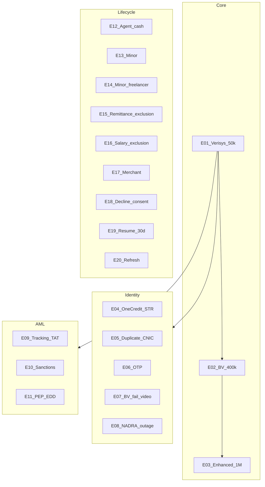

# 11b. EMI customer journeys catalog

> Customer-facing wallet journeys only. Ops queues: [10-aml-risk-edd-ops.md](10-aml-risk-edd-ops.md).  
> **A/B/C/D** as in the pack README. Not legal advice. Fictional personas.

- Pack home: [index.html](index.html)
- Interactive explorer (browser): [05c-emi-interactive-journeys.html](05c-emi-interactive-journeys.html)
- All 20 workflows (PDF): [05c-emi-customer-journeys.pdf](05c-emi-customer-journeys.pdf)

## Index

| ID | Journey | Persona |
|----|---------|---------|
| UJ-E01 | Verisys wallet 50k | Ayesha — first wallet |
| UJ-E02 | NADRA BV upgrade 400k | Ayesha — needs higher load |
| UJ-E03 | Enhanced 1M | Sana — SoF + PSP&OD |
| UJ-E04 | One-credit then unverified close + STR | Policy-enabled pre-verify credit |
| UJ-E05 | Duplicate CNIC | Yasmin — already has wallet |
| UJ-E06 | OTP / 2FA fail | Ayesha — mistype |
| UJ-E07 | BV fail → Verisys stay / video KYC | Bilal — unclear prints |
| UJ-E08 | NADRA timeout | Any |
| UJ-E09 | Tracking ID + TAT 2 WD | Any in review |
| UJ-E10 | Sanctions true match | System decline |
| UJ-E11 | PEP / high-risk EDD + video | Sana |
| UJ-E12 | Agent cash-in/out | Ayesha at agent |
| UJ-E13 | Minor basic linked wallet | Guardian + minor |
| UJ-E14 | Minor freelancer enhanced | Guardian + freelancer minor |
| UJ-E15 | Inward remittance exclusion | Ayesha — home remittance |
| UJ-E16 | Salary credit exclusion | Ayesha — employer IBFT |
| UJ-E17 | Merchant / entity wallet | Phase 2 |
| UJ-E18 | Decline mandatory consents | Ayesha |
| UJ-E19 | Abandon / resume ≤ 30 days | Ayesha |
| UJ-E20 | Periodic / event KYC refresh | Ayesha |

---

### UJ-E01 — Verisys wallet (commercial 50k)

| | Detail |
|--|--------|
| Trigger | Open wallet; digital ID; Verisys + screening pass |
| Customer | OTP, consents, identity, live photo, under review, **Wallet ready — 50,000/month** |
| System | Tracking ID in-app; SMS after OTP; uniqueness; TFS; Verisys; issue instrument at par when funded |
| State | `INITIATED` → `WALLET_ACTIVE` / `VERISYS` |
| Class | **A** EMI §12, §14.II.a, Consolidated TAT/live photo |
| Success | Can receive/pay within 50k load and 10k/day cash-out |
| Alternate | UJ-E05–E11 |
| QA | J-E01–J-E04 |

### UJ-E02 — BV upgrade (400k commercial / 200k pilot)

| | Detail |
|--|--------|
| Trigger | Taps Increase limit |
| Customer | In-app BV or e-Sahulat/ATM instructions |
| System | NADRA BV adapter; `licence_phase` selects 400k vs 200k |
| State | `VERISYS` → `BV` |
| Class | **A** EMI §14; channel **D** |
| Success | Banner shows new monthly load |
| Alternate | UJ-E07, UJ-E08 |

### UJ-E03 — Enhanced 1M

| | Detail |
|--|--------|
| Trigger | Commercial EMI; PSP&OD approved product; customer requests |
| Customer | Uploads income/SoF; may wait |
| System | Annexure-J; **CNIC/SIM pairing**; TMS scenarios; CRP; **no outsourcing** of this verification |
| State | `BV` → `ENHANCED` or remain BV |
| Class | **A** EMI §14.III |

### UJ-E04 — One credit then fail

| | Detail |
|--|--------|
| Trigger | Product enables §12.IV one credit before verification |
| Customer | May see a pending wallet; then closed if ID fails |
| System | Close instrument; **STR** |
| Class | **A** |
| Recommended | Prefer not enabling; if enabled, hard timeout |

### UJ-E05 — Duplicate CNIC

| | Detail |
|--|--------|
| Trigger | CNIC already has an instrument at **this** EMI |
| Customer | **You already have a wallet** — login/recovery. Not a vague reject |
| System | Block second issue |
| Class | **A** EMI §12.VII + Consolidated one-wallet |

### UJ-E06 — OTP / 2FA fail

Wrong OTP never skips `CONTACT_VERIFIED`. Cool-down **D**. Change number = new attempt rules.

### UJ-E07 — BV fail / no branch

Eligible BV fail → keep Verisys 50k **or** Verisys+MSISDN+OTP **or** recorded video KYC + Verisys (Consolidated for EMIs without presence). Debit-block **bank** product is not an e-money construct; use **limit_tier=VERISYS** + explicit banner instead of pretending BV succeeded.

### UJ-E08 — NADRA outage

Stay in progress. Retry. **No** silent 400k. Resume ≤ 30 days.

### UJ-E09 — Tracking + TAT

Tracking ID from Step 0; status without extra PII. If decision > 2 WD after complete file, notify (**A** TAT comms).

### UJ-E10 — Sanctions / fraud true match

Fail closed. No instrument. Written reason. No STP retry.

### UJ-E11 — PEP / high CRP

Customer waits. SoW/SoF + recorded video as EDD. Senior approval is **ops-side**.

### UJ-E12 — Agent cash-in/out

Agent **cannot** open wallet. Cash-in: BV. Cash-out: BV or 2FA if BVS challenged. ATM cash-out: 2FA. Cash **redemption**: BV (**A** §15).

### UJ-E13 — Minor basic

Opened **only** from parent app, linked. 50k Verisys. Funded **only** from parent wallet. Guardian undertaking. TMS.

### UJ-E14 — Minor freelancer enhanced

Same linkage. 400k **BV**. Funding parent **or** verified income. Still **not** adult enhanced 1M. Confirm digital eligibility with Legal.

### UJ-E15 — Remittance exclusion

After SBP FX + AD arrangement. BV holder. Inward AD remittance up to **1.5m** may be **excluded** from load cap **if SBP granted** the exclusion. Still CDD/TMS.

### UJ-E16 — Salary exclusion

Employer credit via nominated bank; EMI verifies employer. BV holders; SBP exclusion granted.

### UJ-E17 — Merchant / entity

Phase 2. Table-B / UBO if legal person. TAT 5 WD. One wallet per entity with this EMI. EPS public signal: merchant wallets exist.

### UJ-E18 — Decline consents

Mandatory T&Cs/NADRA → cannot issue. Draft save **D**.

### UJ-E19 — Resume ≤ 30 days

Last incomplete step. Day 31+ expired; new application.

### UJ-E20 — Refresh

Scheduler by CRP; overdue restriction **explicit**; re-screen; BV may be re-required for high assurance.
