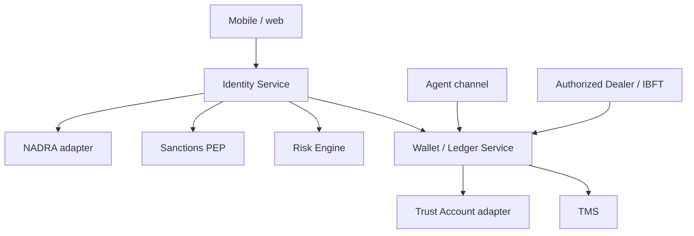

# 12. Architecture and services (EMI)

> Capabilities and adapters — **no proprietary NADRA/PBA payloads**. Not legal advice.

## Context

## Service responsibilities

| Service | Owns | Must not |
|---------|------|----------|
| **Identity Service** (KYC / CDD) | Application state, CDD evidence, `limit_tier` **eligibility**, CNIC uniqueness, consents. Database: `identity_db` | Move money; hold wallet balances |
| **Wallet / Ledger** | E-money balances, load/cash-out **enforcement**, alerts. Database: `ledger_db` | Change KYC state |
| **Trust adapter** | Postings to trustee bank; 50% concentration check | Mix operating funds |
| **NADRA adapter** | Verisys / BV / MSISDN pairing | Store raw biometrics |
| **Screening** | UNSC/ATA/PEP/watchlist | Approve wallets |
| **Risk Engine** | CRP | Bypass TFS |
| **TMS** | Scenarios including 1:N / N:1 (**A** especially for enhanced) | Be outsourced for enhanced-control verification |
| **Agent gateway** | Cash-in/out sessions | `issue_wallet` |
| **Case / video KYC** | EDD recordings | Skip audit |

## Limit enforcement

`limit_tier` × `licence_phase` → monthly load, daily cash-out, enhanced flags. Ledger **rejects** over-limit postings even if the app UI is wrong (**A**).

## Databases

**One database per service.** No shared tables, no cross-database foreign keys. Identity publishes `subject_id` and events; Ledger stores a replica of `limit_tier` and still rejects over-limit postings.

Onboarding tables and ERD: [07-database-and-erd.md](07-database-and-erd.md). Context: [diagrams/08-identity-databases.mmd](diagrams/08-identity-databases.mmd).

Also: `notify_db`, `screening_db`, `tms_db`, `aml_db`, `agent_db`. STR casework is not in Identity — only `str_case_ref`.

## Isolation

- Customer float **≠** EMI operating account.  
- Enhanced §14.III verification functions **in-house**.  
- No offshore outsourcing without SBP written approval.  
- Cloud: BPRD Circular 01/2023.

## Notifications

Real-time alerts for **all** transactions (**A**). Tracking ID SMS **after** OTP only.
