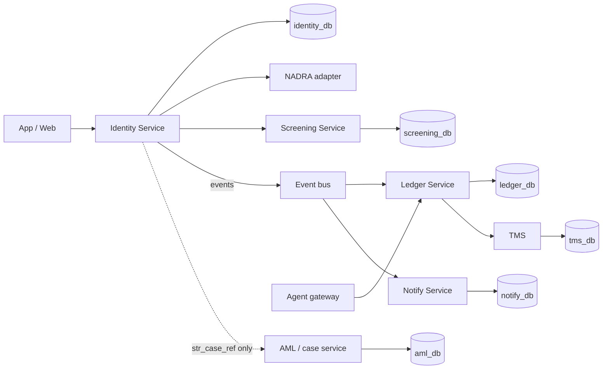
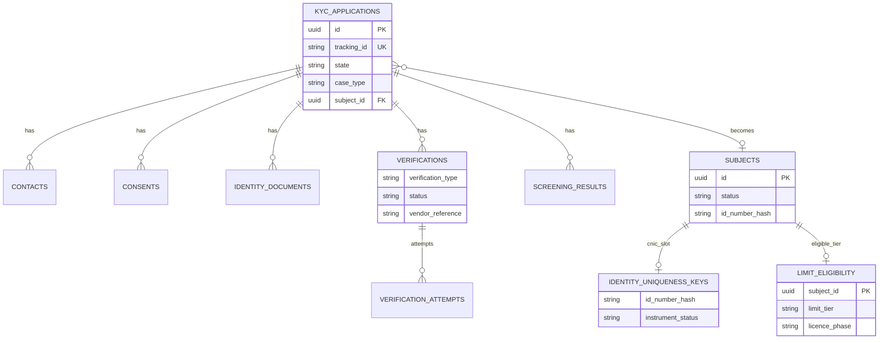
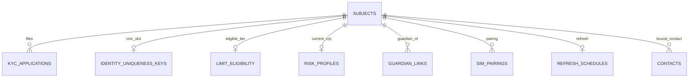

# 13–14. Identity Service data model and ERD

> **This database is the Identity Service (onboarding / CDD) only.** Other capabilities keep their own databases. Logical PostgreSQL-oriented model — not production DDL, not a NADRA spec, not legal advice.

Companion: [06 architecture](06-architecture-and-services.md) · [08 states](08-state-machine.md) · [09 API](09-api-specification.md) · [14 SRS](14-srs.md)  
Diagrams: [08-identity-databases.mmd](diagrams/08-identity-databases.mmd) · [08-identity-erd.mmd](diagrams/08-identity-erd.mmd)

---

## 1. One database per service

No shared tables across services. No cross-database foreign keys. Identity publishes **opaque IDs** and **events**. Consumers store those IDs in *their* schema.

| Database | Service | Owns | Must not store |
|----------|---------|------|----------------|
| **`identity_db`** (this document) | Identity / KYC | Applications, Tracking ID, 2FA bind, consents, §12 / Table-A, live-photo refs, NADRA **vendor refs**, uniqueness of CNIC, `limit_tier` **eligibility**, guardian links, KYC audit | Balances, postings, trust float, agent cash, TMS alerts, STR casework, OTP plaintext, raw biometric templates |
| `ledger_db` | Wallet / Ledger | Instruments, balances, §14 **enforcement**, trust postings, alerts hook | KYC state, consents, NADRA payloads |
| `notify_db` | Notify | Delivery of SMS/push/email | Tracking ID *generation* (Identity mints it) |
| `screening_db` | Screening | List versions, match engine | Wallet approval |
| `tms_db` | TMS | Scenarios, 1:N / N:1 alerts | KYC decisions |
| `aml_db` | AML / cases | STR/TFS filings, EDD ops queues | Customer happy-path state |
| `agent_db` | Agent gateway | Approved agents, cash sessions | `issue_wallet` |

Identity is the **only writer of KYC states**. Ledger is the **only writer of money**. Ledger **copies** `subject_id` + `limit_tier` from Identity events and still rejects over-limit postings (**FR-E27**).



---

## 2. Design principles

1. **Application before subject.** Prospect data lives on `kyc_applications` until uniqueness + Verisys (and screening) allow a `subjects` row and a `WALLET_ELIGIBLE` event.  
2. **Uniqueness is an Identity lock, not a ledger query.** One **open instrument claim** per CNIC hash (**FR-E13**). Ledger cannot mint a second wallet without that claim.  
3. **Eligibility ≠ enforcement.** Identity sets `limit_eligibility.limit_tier`. Ledger enforces PKR caps.  
4. **Append-only evidence.** Verifications, screenings, audit, status history: insert-only.  
5. **Vendor refs, not templates.** NADRA columns are `vendor`, `vendor_reference`, adapter status — no invented API payloads (**FR-E23**).  
6. **No KYC artefacts on the device.** `evidence_objects` point at encrypted object storage (**FR-E05**, **NFR-E02**).  
7. **Soft close, hard retain.** `REJECTED` / `WITHDRAWN` / `EXPIRED` / `CLOSED_UNVERIFIED` stay for ≥ 10 years (**FR-E39**). Silent reopen of a closed CNIC is **off** until Legal signs (**FR-E14**, **O-07**).

---

## 3. Identity ERD

Wallets are **not** on these diagrams. After Identity emits `identity.wallet.eligible`, Ledger inserts its own instrument keyed by `subject_id`.

### 3.1 Core — application becomes a subject



### 3.2 Application case (while onboarding)

```mermaid
erDiagram
  KYC_APPLICATIONS ||--o{ KYC_APPLICATION_PARTIES : parties
  KYC_APPLICATIONS ||--o{ KYC_STATUS_HISTORY : history
  KYC_APPLICATIONS ||--o{ CONTACTS : contacts
  KYC_APPLICATIONS ||--o{ OTP_CHALLENGES : otp
  KYC_APPLICATIONS ||--o{ CONSENTS : consents
  CONSENT_CATALOG ||--o{ CONSENTS : versions
  KYC_APPLICATIONS ||--o| CDD_PROFILES : cdd
  KYC_APPLICATIONS ||--o{ IDENTITY_DOCUMENTS : documents
  KYC_APPLICATIONS ||--o{ EVIDENCE_OBJECTS : evidence
  KYC_APPLICATIONS ||--o{ FACE_CHECKS : liveness
  KYC_APPLICATIONS ||--o{ DEVICE_CAPTURES : open_gadget
  KYC_APPLICATIONS ||--o{ VERIFICATIONS : verifications
  VERIFICATIONS ||--o{ VERIFICATION_ATTEMPTS : attempts
  KYC_APPLICATIONS ||--o{ SCREENING_RESULTS : screens
  KYC_APPLICATIONS ||--o{ RISK_ASSESSMENTS : scores
  KYC_APPLICATIONS ||--o{ KYC_CASES : cases
  KYC_CASES ||--o{ KYC_CASE_ACTIONS : actions
  KYC_APPLICATIONS ||--o{ KYC_DECISIONS : decisions
  KYC_APPLICATIONS ||--o{ KYC_AUDIT_LOGS : audited
```



### 3.3 Subject after eligibility



---

## 4. Table catalog (`identity_db`)

| Table | Purpose | FR |
|-------|---------|-----|
| `licence_settings` | Singleton: `PILOT` / `COMMERCIAL`, PSP&OD enhanced flag, exclusion grants | A-E03, FR-E31, FR-E34 |
| `kyc_applications` | Onboarding / upgrade / refresh header; Tracking ID; state | FR-E01–E04, E40 |
| `kyc_application_parties` | Primary, guardian, associated persons to screen | FR-E15, FR-E32 |
| `kyc_status_history` | Append-only state transitions | FR-E39 |
| `device_captures` | Channel, device hash, IP, geo at open (**A** location) | FR-E05 |
| `contacts` | MSISDN / email; bound flag after OTP | FR-E06 |
| `otp_challenges` | Hashed OTP, attempts, lockout — **never** store the code | FR-E07, NFR-E03 |
| `consent_catalog` | Versioned T&Cs / privacy / NADRA | FR-E09 |
| `consents` | Customer accept/refuse per version | FR-E09, UC-E18 |
| `cdd_profiles` | §12 + Table-A fields (purpose, SoI, FATCA/CRS, PEP declaration, occupation) | FR-E10 |
| `identity_documents` | ID type + encrypted number + hash | FR-E10, FR-E13 |
| `evidence_objects` | Object-store pointers: live photo, live CNIC, video, Annexure-J | FR-E11, FR-E31 |
| `face_checks` | Liveness / selfie match (**B/C**, not NADRA BV) | FR-E11 |
| `identity_uniqueness_keys` | One **OPEN** instrument claim per CNIC hash | FR-E13–E14, UC-E05 |
| `verifications` | Verisys / BV / SIM-pair / video KYC **cases** | FR-E19–E23, E31 |
| `verification_attempts` | Retries, outage, eligible BV fail | FR-E21–E22, UC-E07–E08 |
| `screening_results` | TFS/PEP **outcome** Identity used to move state | FR-E15–E16 |
| `risk_assessments` | Each CRP run | FR-E17, FR-E31 |
| `risk_profiles` | Current rating on the subject | FR-E17 |
| `subjects` | Natural-person master once eligible (not a bank CIF) | FR-E12 |
| `guardian_links` | Minor subject ↔ guardian subject | FR-E32–E33 |
| `sim_pairings` | CNIC/SIM pairing of the **opening** device (enhanced **A**) | FR-E31 |
| `limit_eligibility` | Source of truth for tier Identity may grant | FR-E19–E20, E24–E26 |
| `exclusion_eligibility` | Remittance / salary / utility flags if SBP granted | FR-E34 |
| `kyc_cases` | EDD, sanctions review, video KYC booking | FR-E17, UC-E11 |
| `kyc_case_actions` | Maker-checker (ops; not customer UX) | FR-E17 |
| `kyc_decisions` | Written decline / approve with reason | FR-E04, FR-E16 |
| `refresh_schedules` | Ongoing CDD | UC-E20 |
| `kyc_audit_logs` | Reconstructible KYC actions, insert-only | FR-E39, NFR-E01 |
| `integration_outbox` | Reliable events to Ledger / Notify | D |
| `idempotency_keys` | All Identity POSTs | NFR-E03 |

### Intentionally not in `identity_db`

| Would-be table | Lives in | Why |
|----------------|----------|-----|
| `wallets`, `postings`, `balances` | `ledger_db` | Identity must not move money |
| `trust_postings` | `ledger_db` | FR-E30 |
| `agents`, `cash_sessions` | `agent_db` + ledger legs | FR-E35; agents cannot `POST /wallets` |
| `tms_alerts` | `tms_db` | FR-E38 |
| `str_cases` | `aml_db` | Identity stores `str_case_ref` only |
| `notify_messages` | `notify_db` | SMS of Tracking ID **after** OTP (**FR-E08**) |
| `screening_list_entries` | `screening_db` | Identity stores outcomes, not the UN lists |
| Raw biometric templates | nowhere | FR-E23 |

Phase-2 (P6) add-ins in the **same** Identity DB when Legal opens the flag: `entities`, `entity_parties`, `beneficial_owners` (UC-E17). Do not put them in ledger.

---

## 5. Column structures

Audit pattern on mutable tables: `created_at`, `updated_at`, `created_by`, `updated_by`, `version`. Evidence tables: `created_at` only.

### 5.1 `licence_settings` (one row)

| Column | Type | Notes |
|--------|------|--------|
| `id` | `SMALLINT` PK | Always `1` |
| `licence_phase` | `VARCHAR(16)` | `PILOT` \| `COMMERCIAL` |
| `enhanced_approved` | `BOOLEAN` | PSP&OD §14.III |
| `exclusions_granted` | `BOOLEAN` | Salary / remittance / utility |
| `one_credit_enabled` | `BOOLEAN` | Default **false** (FR-E18) |
| `updated_at` | `TIMESTAMPTZ` | |

App **must not** display a cap this row cannot grant (**A-E03**).

### 5.2 `kyc_applications`

| Column | Type | Notes |
|--------|------|--------|
| `id` | `UUID` PK | |
| `tracking_id` | `VARCHAR(32)` UK | Minted at insert; shown in-app immediately (**FR-E01**) |
| `case_type` | `VARCHAR(32)` | `OPEN` \| `UPGRADE_BV` \| `UPGRADE_ENHANCED` \| `REFRESH` \| `MINOR_OPEN` \| `MINOR_FREELANCER` \| `EXCLUSION` \| `ENTITY_OPEN` |
| `channel` | `VARCHAR(32)` | `MOBILE_IOS` \| `MOBILE_ANDROID` \| `WEB` |
| `state` | `VARCHAR(64)` | See [08](08-state-machine.md) |
| `subject_id` | `UUID` NULL FK | Set when subject is created |
| `guardian_subject_id` | `UUID` NULL | Minor opens **from** guardian app |
| `resume_expires_at` | `TIMESTAMPTZ` | `created_at + 30 days` (**FR-E03**) |
| `complete_file_at` | `TIMESTAMPTZ` | Starts 2 WD TAT (**FR-E04**) |
| `tat_due_at` | `TIMESTAMPTZ` | |
| `tat_notified_at` | `TIMESTAMPTZ` | |
| `sms_tracking_sent_at` | `TIMESTAMPTZ` | Set only after `CONTACT_VERIFIED` (**FR-E08**) |
| `wallet_ref` | `UUID` NULL | Opaque ledger instrument id after ack — **not** an FK |
| `str_case_ref` | `UUID` NULL | Opaque `aml_db` id |
| `idempotency_key` | `VARCHAR(64)` UK | |
| `correlation_id` | `VARCHAR(64)` | |

Unique: `tracking_id`. Index: `(state, tat_due_at)`, `(resume_expires_at)` where state is resumable.

### 5.3 `kyc_application_parties`

| Column | Type | Notes |
|--------|------|--------|
| `id` | `UUID` PK | |
| `application_id` | `UUID` FK | |
| `role` | `VARCHAR(16)` | `PRIMARY` \| `GUARDIAN` \| `ASSOCIATED` |
| `subject_id` | `UUID` NULL | Guardian already exists |
| `full_name` | `VARCHAR(200)` | |
| `id_number_hash` | `CHAR(64)` | For associated-person screening |

### 5.4 `kyc_status_history` (insert-only)

| Column | Type | Notes |
|--------|------|--------|
| `id` | `BIGSERIAL` PK | |
| `application_id` | `UUID` FK | |
| `from_state` | `VARCHAR(64)` | |
| `to_state` | `VARCHAR(64)` | |
| `triggered_by_type` | `VARCHAR(16)` | `SYSTEM` \| `CUSTOMER` \| `OPS` |
| `reason_code` | `VARCHAR(64)` | |
| `correlation_id` | `VARCHAR(64)` | |
| `created_at` | `TIMESTAMPTZ` | |

### 5.5 `device_captures`

| Column | Type | Notes |
|--------|------|--------|
| `id` | `UUID` PK | |
| `application_id` | `UUID` FK | |
| `device_hash` | `VARCHAR(128)` | Not BPRD-04 bind; open-gadget capture (**FR-E05**) |
| `ip_address` | `INET` | |
| `geo_latitude` | `NUMERIC(9,6)` | If permitted |
| `geo_longitude` | `NUMERIC(9,6)` | |
| `user_agent` | `VARCHAR(256)` | |
| `captured_at` | `TIMESTAMPTZ` | |

This is **not** `device_bindings` as an E01/E02 issuance gate (**O-02**).

### 5.6 `contacts` and `otp_challenges`

| Column | Type | Notes |
|--------|------|--------|
| `contacts.id` | `UUID` PK | |
| `application_id` / `subject_id` | `UUID` | |
| `kind` | `VARCHAR(16)` | `MSISDN` \| `EMAIL` |
| `value_encrypted` | `BYTEA` | |
| `value_hash` | `CHAR(64)` | Lookup |
| `pta_registered` | `BOOLEAN` NULL | If the adapter can say |
| `bound_at` | `TIMESTAMPTZ` | OTP success → `CONTACT_VERIFIED` |
| `otp_challenges.id` | `UUID` PK | |
| `contact_id` | `UUID` FK | |
| `code_hash` | `CHAR(64)` | Argon2/bcrypt; **no** plaintext, **no** log |
| `expires_at` | `TIMESTAMPTZ` | |
| `attempt_count` | `INT` | |
| `max_attempts` | `INT` | |
| `locked_until` | `TIMESTAMPTZ` | Cool-down (**D**) |
| `consumed_at` | `TIMESTAMPTZ` | |

Wrong/expired OTP does **not** advance state (**FR-E07**).

### 5.7 Consents

`consent_catalog(code, version, mandatory, locale, body_ref)`  
`consents(application_id, catalog_id, accepted, accepted_at, ip, device_hash)`

Refusal of a **mandatory** row → cannot issue (`WITHDRAWN` / `REJECTED`), not a silent skip (**UC-E18**).

### 5.8 `cdd_profiles` and `identity_documents`

| Column | Type | Notes |
|--------|------|--------|
| `full_name` | `VARCHAR(200)` | §12.I |
| `father_spouse_name` | `VARCHAR(200)` | |
| `mother_maiden_name_encrypted` | `BYTEA` | Extra field not on CNIC |
| `date_of_birth` | `DATE` | |
| `nationality` | `VARCHAR(64)` | |
| `residential_address` | encrypted / or `addresses` child | |
| `occupation` | `VARCHAR(128)` | Table-A |
| `purpose_of_relationship` | `VARCHAR(128)` | |
| `source_of_income` | `VARCHAR(128)` | |
| `pep_self_declared` | `BOOLEAN` | |
| `fatca_crs_status` | `VARCHAR(32)` | |
| `expected_turnover_band` | `VARCHAR(32)` | |
| `identity_documents.id_type` | `VARCHAR(16)` | `CNIC` \| `SNIC` \| `NICOP` \| `POC` \| `PASSPORT` \| `ARC` \| `POR` |
| `id_number_encrypted` | `BYTEA` | |
| `id_number_hash` | `CHAR(64)` | Uniqueness lookups |
| `issue_date` / `expiry_date` | `DATE` | |
| `happy_path_digital` | derived | Adult CNIC/SNIC until Legal opens others (**O-04**) |

UI masks CNIC as `xxxxx-xxxxxxx-x` (**NFR-E01**).

### 5.9 Evidence and face checks

| Column | Type | Notes |
|--------|------|--------|
| `evidence_objects.kind` | `VARCHAR(32)` | `LIVE_PHOTO` \| `LIVE_CNIC` \| `VIDEO_KYC` \| `ANNEXURE_J` \| `UNDERTAKING` |
| `storage_uri` | `VARCHAR(512)` | Encrypted object store |
| `content_sha256` | `CHAR(64)` | |
| `retention_until` | `DATE` | |
| `legal_hold` | `BOOLEAN` | |
| `face_checks.liveness_result` | `VARCHAR(32)` | **B/C** — not Verisys, not BV |
| `face_match_score` | `NUMERIC(5,2)` NULL | |

Selfie / AI face-match **never** sets `limit_tier=BV`.

### 5.10 `identity_uniqueness_keys`

| Column | Type | Notes |
|--------|------|--------|
| `id_number_hash` | `CHAR(64)` | |
| `id_type` | `VARCHAR(16)` | |
| `instrument_status` | `VARCHAR(16)` | `OPEN` \| `CLOSED` \| `BLOCKED` |
| `subject_id` | `UUID` NULL | |
| `opened_application_id` | `UUID` | The OPEN case that won the slot |

**Partial unique index:** `(id_number_hash) WHERE instrument_status = 'OPEN'`. Duplicate attempt → `DUPLICATE_CNIC`, redirect to recovery (**UC-E05**). Closed rows remain for audit; reopen is off (**FR-E14**).

### 5.11 Verifications

| Column | Type | Notes |
|--------|------|--------|
| `verification_type` | `VARCHAR(32)` | `VERISYS` \| `BV` \| `SIM_PAIR` \| `VIDEO_KYC` \| `ALTERNATE_ID` |
| `channel` | `VARCHAR(32)` | `IN_APP` \| `E_SAHULAT` \| `ATM` \| `VIDEO` — **D** except pairing at enhanced |
| `status` | `VARCHAR(32)` | `PENDING` \| `IN_PROGRESS` \| `PASSED` \| `FAILED` \| `ELIGIBLE_FAIL` \| `VENDOR_UNAVAILABLE` |
| `vendor` | `VARCHAR(64)` | Adapter name, not a NADRA RPC |
| `vendor_reference` | `VARCHAR(128)` | Token only |
| `eligible_fail_reason` | `VARCHAR(32)` | `DISABILITY` \| `UNCLEAR_PRINTS` \| `AGE_OVER_60` |
| `attempts.attempt_no` | `INT` | |
| `attempts.result_code` | `VARCHAR(64)` | Include timeout/503 — stay in progress, **no** silent 400k |

BV success is the **only** path to `limit_tier=BV`. Finger/thumb/iris, or NADRA face **if** the contract says facial BioVerisys is live (**O-03**).

### 5.12 Screening and risk

`screening_results`: `SANCTIONS` \| `PEP` \| `WATCHLIST`; status `CLEAR` \| `POTENTIAL_HIT` \| `CONFIRMED_HIT` \| `ERROR`; `list_version`; `raw_result_ref` (encrypted blob pointer); `adjudicated_by` / `at`.

Confirmed hit → application `REJECTED`, **never** `WALLET_ACTIVE`, no STP retry (**UC-E10**). Identity emits `identity.application.rejected`; AML service opens STR.

`risk_assessments`: `model_version`, `risk_rating` (`LOW`/`MEDIUM`/`HIGH`), `edd_required`, `factors` JSONB (no extra PII). High / PEP → `EDD_REQUIRED` + video KYC (**UC-E11**).

### 5.13 `subjects`, guardians, SIM pairing, eligibility

| Table | Key columns |
|-------|-------------|
| `subjects` | `id`, `status` (`ELIGIBLE` \| `ACTIVE_CLAIM` \| `CLOSED` \| `REJECTED`), `id_number_hash`, `created_from_application_id` (no FK — insert application first, then subject, then set `applications.subject_id`) |
| `guardian_links` | `minor_subject_id` UK, `guardian_subject_id`, `funding_rule` (`GUARDIAN_ONLY` \| `GUARDIAN_OR_VERIFIED_INCOME`), `undertaking_evidence_id` |
| `sim_pairings` | `subject_id`, `msisdn_hash`, `device_hash`, `paired_at`, `vendor_reference` — required for **ENHANCED** only |
| `limit_eligibility` | `subject_id` PK, `limit_tier` (`VERISYS` \| `BV` \| `ENHANCED` \| `MINOR_BASIC` \| `MINOR_FREELANCER`), `licence_phase` snapshot, `granted_at`, `granted_by_verification_id` |
| `exclusion_eligibility` | `subject_id`, `remittance` / `salary` / `utility` booleans — BV holders, not minors, only if `licence_settings.exclusions_granted` |

Adult §14.I–III enhanced limits **do not** apply to minors (**FR-E32**).

### 5.14 Cases, decisions, refresh, audit, outbox

- `kyc_cases`: `MANUAL_REVIEW` \| `EDD` \| `SANCTIONS_HIT` \| `VIDEO_KYC` \| `DUPLICATE` \| `DOC_EXCEPTION`; `sla_due_at`.  
- `kyc_decisions`: `APPROVE` \| `DECLINE` \| `REQUEST_INFO`; `reason_code`; `reason_text` (customer-visible, specific, in writing).  
- `refresh_schedules`: `next_due_at`, `last_completed_application_id`.  
- `kyc_audit_logs`: insert-only; `action`, `actor_*`, `payload_hash`, `previous_state`, `new_state`; **no OTP values**.  
- `integration_outbox`: `event_type`, `payload` JSONB (minimal PII), `published_at`.  
- `idempotency_keys`: `(key, request_hash)` unique.

---

## 6. DDL sketch (core)

```sql
CREATE TABLE licence_settings (
  id SMALLINT PRIMARY KEY CHECK (id = 1),
  licence_phase VARCHAR(16) NOT NULL CHECK (licence_phase IN ('PILOT','COMMERCIAL')),
  enhanced_approved BOOLEAN NOT NULL DEFAULT FALSE,
  exclusions_granted BOOLEAN NOT NULL DEFAULT FALSE,
  one_credit_enabled BOOLEAN NOT NULL DEFAULT FALSE,
  updated_at TIMESTAMPTZ NOT NULL DEFAULT now()
);

CREATE TABLE subjects (
  id UUID PRIMARY KEY,
  status VARCHAR(32) NOT NULL,
  id_number_hash CHAR(64) NOT NULL,
  created_from_application_id UUID NOT NULL,
  created_at TIMESTAMPTZ NOT NULL DEFAULT now(),
  updated_at TIMESTAMPTZ NOT NULL DEFAULT now(),
  version INT NOT NULL DEFAULT 1
);

CREATE TABLE kyc_applications (
  id UUID PRIMARY KEY,
  tracking_id VARCHAR(32) NOT NULL UNIQUE,
  case_type VARCHAR(32) NOT NULL,
  channel VARCHAR(32) NOT NULL,
  state VARCHAR(64) NOT NULL,
  subject_id UUID REFERENCES subjects(id),
  guardian_subject_id UUID REFERENCES subjects(id),
  resume_expires_at TIMESTAMPTZ NOT NULL,
  complete_file_at TIMESTAMPTZ,
  tat_due_at TIMESTAMPTZ,
  tat_notified_at TIMESTAMPTZ,
  sms_tracking_sent_at TIMESTAMPTZ,
  wallet_ref UUID,
  str_case_ref UUID,
  idempotency_key VARCHAR(64) UNIQUE,
  correlation_id VARCHAR(64),
  created_at TIMESTAMPTZ NOT NULL DEFAULT now(),
  updated_at TIMESTAMPTZ NOT NULL DEFAULT now(),
  version INT NOT NULL DEFAULT 1
);

CREATE TABLE identity_uniqueness_keys (
  id UUID PRIMARY KEY,
  id_number_hash CHAR(64) NOT NULL,
  id_type VARCHAR(16) NOT NULL,
  instrument_status VARCHAR(16) NOT NULL,
  subject_id UUID REFERENCES subjects(id),
  opened_application_id UUID NOT NULL REFERENCES kyc_applications(id),
  created_at TIMESTAMPTZ NOT NULL DEFAULT now()
);
CREATE UNIQUE INDEX uq_open_cnic_instrument
  ON identity_uniqueness_keys (id_number_hash)
  WHERE instrument_status = 'OPEN';

CREATE TABLE contacts (
  id UUID PRIMARY KEY,
  application_id UUID NOT NULL REFERENCES kyc_applications(id),
  subject_id UUID REFERENCES subjects(id),
  kind VARCHAR(16) NOT NULL,
  value_encrypted BYTEA NOT NULL,
  value_hash CHAR(64) NOT NULL,
  bound_at TIMESTAMPTZ,
  created_at TIMESTAMPTZ NOT NULL DEFAULT now()
);

CREATE TABLE otp_challenges (
  id UUID PRIMARY KEY,
  contact_id UUID NOT NULL REFERENCES contacts(id),
  code_hash CHAR(64) NOT NULL,
  expires_at TIMESTAMPTZ NOT NULL,
  attempt_count INT NOT NULL DEFAULT 0,
  max_attempts INT NOT NULL,
  locked_until TIMESTAMPTZ,
  consumed_at TIMESTAMPTZ,
  created_at TIMESTAMPTZ NOT NULL DEFAULT now()
);

CREATE TABLE verifications (
  id UUID PRIMARY KEY,
  application_id UUID NOT NULL REFERENCES kyc_applications(id),
  verification_type VARCHAR(32) NOT NULL,
  channel VARCHAR(32),
  status VARCHAR(32) NOT NULL,
  vendor VARCHAR(64),
  vendor_reference VARCHAR(128),
  eligible_fail_reason VARCHAR(32),
  created_at TIMESTAMPTZ NOT NULL DEFAULT now(),
  completed_at TIMESTAMPTZ
);

CREATE TABLE limit_eligibility (
  subject_id UUID PRIMARY KEY REFERENCES subjects(id),
  limit_tier VARCHAR(32) NOT NULL,
  licence_phase VARCHAR(16) NOT NULL,
  granted_at TIMESTAMPTZ NOT NULL DEFAULT now(),
  granted_by_verification_id UUID REFERENCES verifications(id)
);

CREATE TABLE kyc_audit_logs (
  id BIGSERIAL PRIMARY KEY,
  occurred_at TIMESTAMPTZ NOT NULL DEFAULT now(),
  application_id UUID,
  subject_id UUID,
  actor_type VARCHAR(16) NOT NULL,
  actor_id VARCHAR(64),
  action VARCHAR(64) NOT NULL,
  previous_state VARCHAR(64),
  new_state VARCHAR(64),
  correlation_id VARCHAR(64),
  payload_hash CHAR(64) NOT NULL,
  schema_version INT NOT NULL DEFAULT 1
);
-- GRANT INSERT, SELECT ON kyc_audit_logs TO identity_app; -- no UPDATE/DELETE
```

Remaining tables follow the column lists in §5. App role: no `DELETE` on evidence, uniqueness, audit, or history.

---

## 7. Integration contract (no shared DB)

Identity **outbox** events (minimal PII):

| Event | When | Consumed by |
|-------|------|-------------|
| `identity.application.initiated` | Tracking ID minted, state `INITIATED` | Analytics / audit replica |
| `identity.contact.verified` | OTP success | **Notify** — SMS Tracking ID to bound MSISDN |
| `identity.wallet.eligible` | Screening + Verisys pass; uniqueness OPEN; `limit_tier=VERISYS` | **Ledger** — create instrument at par when funded |
| `identity.limit_tier.changed` | BV / enhanced / minor freelancer | **Ledger** — switch policy; still reject over-cap |
| `identity.application.rejected` | Sanctions / consent refuse / written decline | Ledger (do not issue), AML, Notify |
| `identity.application.closed_unverified` | One-credit flag failed | Ledger close, AML STR |
| `identity.duplicate_cnic` | Uniqueness hit | App redirect; no second instrument |

Ledger stores `subject_id UUID NOT NULL` and `limit_tier VARCHAR(32)` as a **replica**. If replica and Identity disagree, **Identity wins eligibility**; **Ledger wins the posting** (fail closed on cap).

Notify does not generate Tracking IDs. Agent APIs never call Identity `POST /kyc/applications` to issue.

---

## 8. Ledger DB (stub — not this service)

Enough to keep money out of Identity. Full ledger model is a separate document when that service is designed.

| Table | Role |
|-------|------|
| `wallets` | `id`, `subject_id`, `status`, `limit_tier` replica, `opened_at` |
| `limit_policies` | `limit_tier` × `licence_phase` → monthly load, daily cash-out |
| `postings` | Legs; payments vs receipts **separate buckets** (**FR-E24**) |
| `trust_postings` | Par issue/redeem vs trustee |
| `alert_outbox` | Real-time alert per posting (**FR-E37**) |

Unique open wallet per `subject_id` where status in (`ACTIVE`,`RESTRICTED`) — **defence in depth**; Identity uniqueness remains authoritative for CNIC.

---

## 9. Retention and PII

| Class | Rule |
|-------|------|
| CDD + decisions + uniqueness + audit | ≥ **10 years** (EMI §24.II) or stricter law |
| Call / video KYC recordings | **1 year** unless Legal hold |
| OTP hashes | Until consumed + short cool-down; never the code |
| Object-store KYC media | Encrypted; not on capture device; purpose-limited |

Encryption at rest for CNIC, mother’s name, MSISDN, vendor biometric **tokens**. Cloud: BPRD 01/2023. No offshore without SBP written approval (**NFR-E05**).

---

## 10. Traceability (table → use case)

| Cluster | UC | Notes |
|---------|----|--------|
| applications + tracking + history | UC-E01, E09, E19, S01 | Tracking in-app at Step 0 |
| otp + contacts | UC-E06 | Stay `INITIATED` on fail |
| consents | UC-E18 | |
| uniqueness | UC-E05 | |
| verifications VERISYS | UC-E01 | |
| verifications BV | UC-E02, E07, E08 | |
| sim_pairings + Annexure-J evidence | UC-E03 | P5 |
| screening_results | UC-E10, S02 | |
| kyc_cases video | UC-E11 | Ops UI not a customer journey |
| guardian_links | UC-E13, E14 | P6 |
| exclusion_eligibility | UC-E15, E16 | P6 |
| limit_eligibility | UC-S03 (event to ledger) | |
| outbox → notify | UC-S04 is **ledger** alerts; Tracking SMS is Notify on E08 | |

QA IDs J-E01–J-E07 still exercise the customer path; they do not read `ledger_db`.
