# Dummy Sample Data & Inter-Table Data Flow

> **Fictional only.** No real customer PII. CNIC/mobile/email shapes are fake.  
> Scenario: Conventional DRB — low-risk straight-through onboarding that ends in an active account.  
> Related: [01-complete-ddl.sql](01-complete-ddl.sql) · [02-data-dictionary-complete.md](02-data-dictionary-complete.md)

---

## Scenario overview

| Field | Dummy value |
|-------|-------------|
| Customer | **ALI RAZA** (fictional) |
| Tracking ID | `TRK-20260912-8F2K` |
| Application ID | `aaaaaaaa-0001-4000-8000-000000000001` |
| Outcome | `APPROVED` → CIF + IBAN, no debit block |
| Path | OTP → consents → identity → live photo → BV success → profile → screening CLEAR → risk LOW → STP approve → account ACTIVE |

Fixed IDs used below (easy to follow FKs):

| Entity | UUID |
|--------|------|
| Application | `aaaaaaaa-0001-4000-8000-000000000001` |
| Party (primary) | `bbbbbbbb-0001-4000-8000-000000000001` |
| Identity | `cccccccc-0001-4000-8000-000000000001` |
| Mobile contact | `dddddddd-0001-4000-8000-000000000001` |
| Email contact | `dddddddd-0001-4000-8000-000000000002` |
| Mailing address | `eeeeeeee-0001-4000-8000-000000000001` |
| Permanent address | `eeeeeeee-0001-4000-8000-000000000002` |
| Occupation | `ffffffff-0001-4000-8000-000000000001` |
| Tax | `11111111-0001-4000-8000-000000000001` |
| OTP challenge | `22222222-0001-4000-8000-000000000001` |
| BV verification | `33333333-0001-4000-8000-000000000001` |
| Live photo doc | `44444444-0001-4000-8000-000000000001` |
| Face check | `55555555-0001-4000-8000-000000000001` |
| Sanctions screen | `66666666-0001-4000-8000-000000000001` |
| PEP screen | `66666666-0001-4000-8000-000000000002` |
| Risk assessment | `77777777-0001-4000-8000-000000000001` |
| Decision | `88888888-0001-4000-8000-000000000001` |
| Customer | `99999999-0001-4000-8000-000000000001` |
| Account | `aaaaaaaa-0002-4000-8000-000000000001` |

---

## How data flows between tables (happy path)

```text
1. START
   kyc_applications  ←── creates header (tracking_id, state=INITIATED, geo/IP)
         │
         ├──► device_bindings          (device hash linked to application)
         ├──► identity_uniqueness_keys (optional early mobile/device keys)
         └──► kyc_status_history + kyc_audit_logs  (every transition)

2. CONTACT VERIFY
   customer_contacts (MOBILE, unverified)
         │
         └──► otp_challenges (code_hash)
                   │
                   └──► customer_contacts.is_verified = true
                        kyc_applications.state = CONTACT_VERIFIED

3. CONSENTS
   kyc_consents  × N  (TNC, PRIVACY, BV_NADRA, …)
         └──► state = CONSENT_CAPTURED

4. IDENTITY + CDD PROFILE
   kyc_application_parties (PRIMARY)
         │
   customer_identities  ←── CNIC fields (encrypted + hash)
   customer_addresses   ←── MAILING + PERMANENT
   customer_occupations_income
   customer_tax_profiles
         │
         └──► identity_uniqueness_keys (CNIC_HASH ACTIVE check — no duplicate)

5. LIVE PHOTO + FACE
   kyc_documents (LIVE_PHOTO) ──► object store URI
         │
         └──► face_checks (liveness + match scores)
              state → LIVE_PHOTO_CAPTURED

6. NADRA BV
   kyc_verifications (BV_FINGER, SUCCESS)
         │
         └──► kyc_verification_attempts (attempt_no=1, result=SUCCESS)
              state → IDENTITY_VERIFIED → PROFILE_COMPLETE

7. SCREENING
   screening_results (SANCTIONS=CLEAR)
   screening_results (PEP=CLEAR)
         └──► (if POTENTIAL_HIT → kyc_cases → kyc_case_actions → back to decision)
              here: clear → continue

8. RISK
   customer_risk_assessments (LOW, model_version)
         └──► no case opened (STP)

9. DECISION
   kyc_decisions (APPROVE, STP)
         └──► state = APPROVED
              kyc_status_history + kyc_audit_logs

10. PROVISION
    customers  ←── CIF created; application.customer_id set
         │
         ├──► customer_risk_profiles (current LOW)
         ├──► kyc_refresh_schedules (next_due_at)
         ├──► accounts (IBAN, debit_block=false, ACTIVE)
         ├──► identity_uniqueness_keys (bind CNIC+mobile to customer_id)
         └──► device_bindings.customer_id set; is_trusted=true

    application.state → ACCOUNT_PENDING → ACTIVE
```

### Mermaid — row linkage

```mermaid
flowchart TD
  APP[kyc_applications]
  PARTY[kyc_application_parties]
  ID[customer_identities]
  CT[customer_contacts]
  OTP[otp_challenges]
  ADDR[customer_addresses]
  OCC[customer_occupations_income]
  TAX[customer_tax_profiles]
  CNS[kyc_consents]
  DOC[kyc_documents]
  FACE[face_checks]
  VER[kyc_verifications]
  ATT[kyc_verification_attempts]
  SCR[screening_results]
  RISK[customer_risk_assessments]
  DEC[kyc_decisions]
  HIST[kyc_status_history]
  AUD[kyc_audit_logs]
  CUST[customers]
  RPROF[customer_risk_profiles]
  REF[kyc_refresh_schedules]
  ACCT[accounts]
  DEV[device_bindings]
  UNIQ[identity_uniqueness_keys]

  APP --> PARTY
  APP --> ID
  APP --> CT
  CT --> OTP
  APP --> ADDR
  APP --> OCC
  APP --> TAX
  APP --> CNS
  APP --> DOC
  DOC --> FACE
  APP --> FACE
  APP --> VER
  VER --> ATT
  APP --> SCR
  APP --> RISK
  APP --> DEC
  APP --> HIST
  APP --> AUD
  APP --> CUST
  CUST --> RPROF
  CUST --> REF
  CUST --> ACCT
  APP --> DEV
  CUST --> DEV
  APP --> UNIQ
  CUST --> UNIQ
```



---

## Dummy rows (readable form)

### 1. `kyc_applications` (hub row — everything hangs off this)

| Column | Dummy value |
|--------|-------------|
| id | `aaaaaaaa-0001-4000-8000-000000000001` |
| tracking_id | `TRK-20260912-8F2K` |
| channel | `MOBILE_ANDROID` |
| product_code | `CONVENTIONAL_SAVINGS` |
| regulatory_phase | `COMMERCIAL` |
| state | `ACTIVE` *(final; was INITIATED → … → APPROVED → ACCOUNT_PENDING)* |
| debit_block_intended | `false` |
| bv_pending | `false` |
| edd_required | `false` |
| ekyc_prefetch_used | `false` |
| device_id_hash | `devhash_a1b2c3d4…` |
| ip_address | `103.255.10.20` |
| geo_latitude / longitude | `31.520400` / `74.358700` (Lahore — fictional session) |
| complete_documents_at | `2026-09-12 10:18:00+05` |
| tat_due_at | `2026-09-16 18:00:00+05` |
| resume_expires_at | `2026-10-12 10:05:00+05` |
| customer_id | `99999999-0001-4000-8000-000000000001` |
| idempotency_key | `idem-start-ali-001` |

**Flow role:** Parent key. Almost all child tables store `application_id` pointing here.

---

### 2. `kyc_application_parties`

| id | application_id | party_role | is_primary |
|----|----------------|------------|------------|
| `bbbbbbbb-0001-…0001` | `aaaaaaaa-0001-…0001` | PRIMARY | true |

**Flow role:** Used later if screening must name “which person”; v1 usually one primary.

---

### 3. `customer_contacts` + `otp_challenges`

**contacts**

| id | type | masked | verified | msisdn_cnic_paired |
|----|------|--------|----------|--------------------|
| `dddddddd-…0001` | MOBILE | `0300-***6789` | true | true |
| `dddddddd-…0002` | EMAIL | `a***@example.com` | true | null |

**otp_challenges**

| id | contact_id | channel | code_hash | consumed_at |
|----|------------|---------|-----------|-------------|
| `22222222-…0001` | `dddddddd-…0001` | SMS | `sha256(otp)` | `2026-09-12 10:06:12+05` |

**Flow:** Application creates contact → OTP row → on success contact flips `is_verified` → application state advances. OTP row is short-lived; contact row remains.

---

### 4. `kyc_consents`

| consent_type | policy_version | accepted |
|--------------|----------------|----------|
| TNC | `tnc-2026.3` | true |
| PRIVACY | `privacy-2026.1` | true |
| KFS | `kfs-savings-1.0` | true |
| BV_NADRA | `bv-consent-1.0` | true |
| EKYC_READ | `ekyc-1.0` | false *(customer declined shared e-KYC)* |

**Flow:** All mandatory consents must exist before identity verify / BV. Declined EKYC → no `shared_ekyc_exchanges` fetch (or status SKIPPED).

---

### 5. `customer_identities`

| Field | Dummy |
|-------|-------|
| id_type | CNIC |
| id_number_masked | `35202-*******-1` |
| id_number_hash | `cnic_hash_ali_001…` |
| full_name | ALI RAZA |
| father_spouse_name | AHMED RAZA |
| date_of_birth | 1992-08-20 |
| place_of_birth | LAHORE |
| gender | M |
| issue_date / expiry_date | 2019-04-15 / 2029-04-15 |

**Flow:** Written at identity step. Hash checked against `identity_uniqueness_keys` before continue. After approve, `customer_id` filled on this row.

---

### 6. `customer_addresses`

| type | line1 | city | same_as_id |
|------|-------|------|------------|
| PERMANENT | House 12, Street 4, Gulberg | Lahore | true |
| MAILING | Same / or different office | Lahore | false |

---

### 7. `customer_occupations_income`

| Field | Dummy |
|-------|-------|
| profession_code | SALARIED |
| employer_or_business_name | EXAMPLE TECH PVT LTD |
| designation | Software Engineer |
| source_of_income | SALARY |
| source_of_funds | SALARY |
| self_declaration | false |
| purpose_of_account | SALARY_SAVINGS |
| expected_monthly_income | 150000.00 |
| expected_debit_turnover | 80000.00 |
| expected_credit_turnover | 150000.00 |

**Flow:** Feeds **Risk Engine** factors (occupation, turnover). May link to `kyc_documents` type `SOI_PROOF` if required (not needed in this low-risk salaried example if policy allows salary slip later — here none attached).

---

### 8. `customer_tax_profiles`

| residency_status | us_person | foreign_tax_resident |
|------------------|-----------|----------------------|
| RESIDENT_PK | false | false |

---

### 9. `kyc_documents` + `face_checks`

**document**

| id | document_type | storage_uri |
|----|---------------|-------------|
| `44444444-…0001` | LIVE_PHOTO | `s3://kyc-docs/app-aaa…/live.jpg.enc` |

**face_checks**

| live_photo_document_id | liveness_score | match_score | match_passed |
|------------------------|----------------|-------------|--------------|
| `44444444-…0001` | 0.97 | 0.91 | true |

**Flow:** Document metadata first → face_checks references document id → KYC service allows verification step.

---

### 10. `kyc_verifications` + `kyc_verification_attempts`

**verification**

| id | type | status | vendor_reference | assurance_level |
|----|------|--------|------------------|-----------------|
| `33333333-…0001` | BV_FINGER | SUCCESS | `NADRA-BV-REQ-778899` | BV_NADRA |

**attempt**

| verification_id | attempt_no | result_code | latency_ms |
|-----------------|------------|-------------|------------|
| `33333333-…0001` | 1 | SUCCESS | 1840 |

**Flow:** Parent verification case → child attempts for retries. Success clears `bv_pending` on application.

---

### 11. `screening_results`

| id | screening_type | status | list_version |
|----|----------------|--------|--------------|
| `66666666-…0001` | SANCTIONS | CLEAR | `UNSC+ATA-2026-09-12` |
| `66666666-…0002` | PEP | CLEAR | `PEP-DB-2026.09` |

**Flow:** Both rows share `application_id`. CLEAR → risk. POTENTIAL_HIT would create `kyc_cases` (not in this scenario).

---

### 12. `customer_risk_assessments`

| id | risk_rating | score | edd_required | model_version |
|----|-------------|-------|--------------|---------------|
| `77777777-…0001` | LOW | 0.18 | false | `crp-2026.1` |

Example `factors_json`:

```json
{
  "CHANNEL_DIGITAL": 0.05,
  "BV_ASSURANCE": -0.04,
  "OCCUPATION_SALARIED": -0.02,
  "SCREENING_CLEAR": -0.03
}
```

---

### 13. `kyc_decisions` (no case — STP)

| id | decision | decision_mode | decided_by | restrictions_json |
|----|----------|---------------|------------|-------------------|
| `88888888-…0001` | APPROVE | STP | SYSTEM | `[]` |

**Flow:** Written once. Triggers Customer/Account provisioning. Reject path would also insert `kyc_application_rejection_reasons`.

---

### 14. `kyc_status_history` (sample transitions)

| from_state | to_state | triggered_by_type |
|------------|----------|-------------------|
| null | INITIATED | SYSTEM |
| INITIATED | CONTACT_VERIFIED | CUSTOMER |
| CONTACT_VERIFIED | CONSENT_CAPTURED | CUSTOMER |
| CONSENT_CAPTURED | IDENTITY_CAPTURED | CUSTOMER |
| IDENTITY_CAPTURED | LIVE_PHOTO_CAPTURED | CUSTOMER |
| LIVE_PHOTO_CAPTURED | IDENTITY_VERIFICATION_IN_PROGRESS | SYSTEM |
| IDENTITY_VERIFICATION_IN_PROGRESS | IDENTITY_VERIFIED | SYSTEM |
| IDENTITY_VERIFIED | PROFILE_COMPLETE | CUSTOMER |
| PROFILE_COMPLETE | SCREENING_IN_PROGRESS | SYSTEM |
| SCREENING_IN_PROGRESS | RISK_ASSESSMENT_IN_PROGRESS | SYSTEM |
| RISK_ASSESSMENT_IN_PROGRESS | APPROVED | SYSTEM |
| APPROVED | ACCOUNT_PENDING | SYSTEM |
| ACCOUNT_PENDING | ACTIVE | SYSTEM |

**Flow:** Append-only mirror of application.state changes. Never update old rows.

---

### 15. `customers` + `accounts` + `customer_risk_profiles` + `kyc_refresh_schedules`

**customers**

| id | cif | full_name | status | kyc_status | risk_rating |
|----|-----|-----------|--------|------------|-------------|
| `99999999-…0001` | `CIF0001001` | ALI RAZA | ACTIVE | COMPLETE | LOW |

**accounts**

| id | account_number | iban | status | debit_block | daily_debit_limit |
|----|----------------|------|--------|-------------|-------------------|
| `aaaaaaaa-0002-…0001` | `00120034005678` | `PK00BANK00120034005678` | ACTIVE | false | 500000.00 |

**customer_risk_profiles**

| customer_id | risk_rating | last_assessment_id | enhanced_monitoring |
|-------------|-------------|--------------------|---------------------|
| `99999999-…0001` | LOW | `77777777-…0001` | false |

**kyc_refresh_schedules**

| customer_id | frequency_days | next_due_at | status |
|-------------|----------------|-------------|--------|
| `99999999-…0001` | 365 | `2027-09-12` | SCHEDULED |

**Flow:** Decision APPROVE → insert customer → update `kyc_applications.customer_id` → insert account → insert risk profile + refresh schedule → stamp identity/contact rows with `customer_id`.

---

### 16. `device_bindings` + `identity_uniqueness_keys` + audit sample

**device_bindings**

| device_id_hash | application_id | customer_id | is_trusted |
|----------------|----------------|-------------|------------|
| `devhash_a1b2c3d4…` | `aaaaaaaa-0001-…` | `99999999-…` | true |

**identity_uniqueness_keys**

| key_type | key_hash | customer_id | status |
|----------|----------|-------------|--------|
| CNIC_HASH | `cnic_hash_ali_001…` | `99999999-…` | ACTIVE |
| MOBILE_HASH | `mobile_hash_0300…` | `99999999-…` | ACTIVE |

**kyc_audit_logs** (one example row)

| action | previous_state | new_state | actor_type | external_reference |
|--------|----------------|-----------|------------|--------------------|
| KYC_DECISION | RISK_ASSESSMENT_IN_PROGRESS | APPROVED | SYSTEM | null |
| BIOMETRIC_ATTEMPT | … | … | SYSTEM | `NADRA-BV-REQ-778899` |

---

## Alternate flow (what would differ)

### A) Sanctions potential hit

```text
screening_results.status = POTENTIAL_HIT
  → kyc_cases (SANCTIONS_HIT)
  → kyc_case_actions (maker propose false positive)
  → kyc_case_actions (checker confirm)
  → screening_results.adjudicated_status = FALSE_POSITIVE
  → continue to risk / decision
```

### B) Debit-block path (BV not possible; Verisys used)

```text
kyc_verifications type=VERISYS + MSISDN_PAIR
kyc_applications.debit_block_intended = true
kyc_decisions.restrictions_json = {"debit_block": true}
accounts.status = RESTRICTED_ACTIVE, debit_block = true
Later BV success → lift flag → ACTIVE
```

### C) High risk / EDD

```text
customer_risk_assessments.risk_rating = HIGH, edd_required = true
  → kyc_cases (EDD)
  → kyc_documents (VIDEO_KYC)
  → kyc_case_actions (maker + checker + senior)
  → kyc_decisions (MANUAL APPROVE)
  → customer_risk_profiles.enhanced_monitoring = true
```

---

## Runnable dummy SQL

See [03-sample-data.sql](03-sample-data.sql) for INSERT statements matching these IDs (assumes schema from `01-complete-ddl.sql` already applied). Encrypted BYTEA columns use `convert_to('DUMMY', 'UTF8')` placeholders — replace with real encryption in production.

---

## One-sentence summary

**`kyc_applications` is the spine;** contacts/OTP/consents/identity/docs/verifications/screening/risk hang off it during onboarding; **`kyc_decisions` is the gate**; on approve, data **forks into `customers` + `accounts`** while evidence tables stay linked by `application_id` for audit forever.
