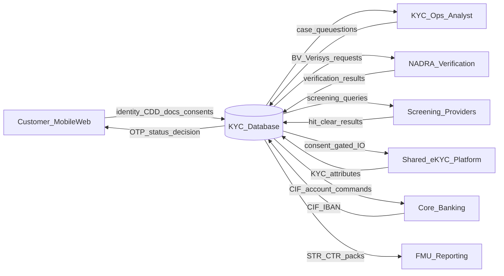
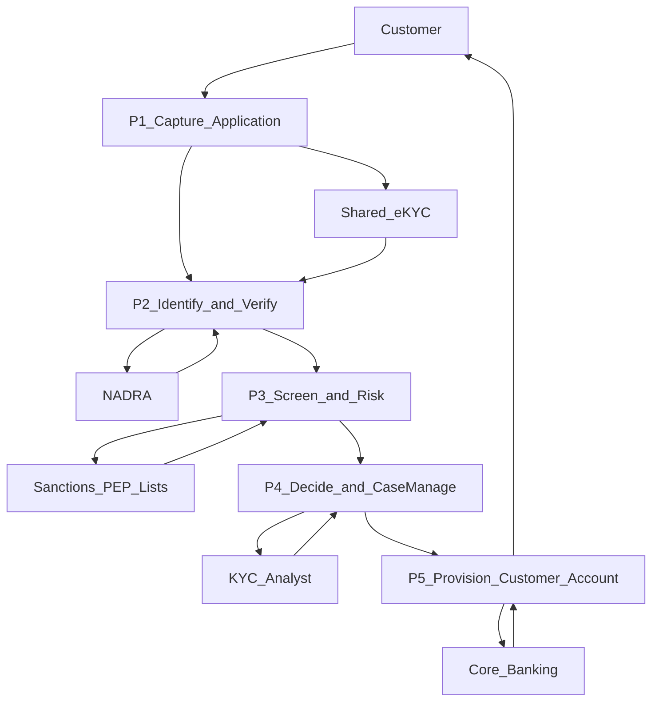
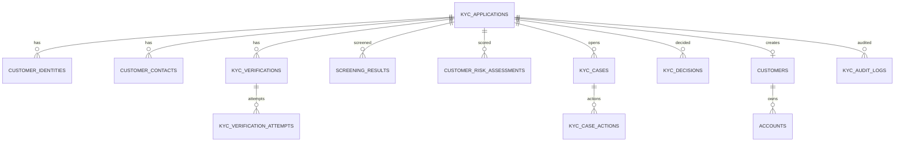

# KYC Database — Complete Structure, Data Dictionary, DFD & ERD

> Companion to [07-database-and-erd.md](../07-database-and-erd.md).  
> Conventional Digital Retail Bank (Pakistan). Not legal advice.

---

## Contents

| Artifact | File |
|----------|------|
| Complete DDL (PostgreSQL) | [01-complete-ddl.sql](01-complete-ddl.sql) |
| Full data dictionary (every table & column purpose) | [02-data-dictionary-complete.md](02-data-dictionary-complete.md) |
| Dummy sample data + inter-table data flow | [03-sample-data-and-flow.md](03-sample-data-and-flow.md) |
| Dummy SQL INSERTs (fictional Ali Raza journey) | [03-sample-data.sql](03-sample-data.sql) |
| Context DFD (Level 0) | [../diagrams/13-kyc-dfd-context.mmd](../diagrams/13-kyc-dfd-context.mmd) |
| Level-1 DFD | [../diagrams/14-kyc-dfd-level1.mmd](../diagrams/14-kyc-dfd-level1.mmd) |
| Detailed ERD | [../diagrams/15-kyc-erd-detailed.mmd](../diagrams/15-kyc-erd-detailed.mmd) |
| Logical DB architecture | [../diagrams/04-database-architecture.mmd](../diagrams/04-database-architecture.mmd) |

---

## Table inventory (purpose)

| # | Table | Purpose |
|---|-------|---------|
| 1 | `kyc_applications` | Onboarding application header + state machine + TAT/geo |
| 2 | `kyc_application_parties` | Primary/joint/mandate party links |
| 3 | `customer_identities` | CNIC/ID CDD identity attributes (encrypted PII) |
| 4 | `customer_contacts` | Mobile/email/emergency + verification flags |
| 5 | `customer_addresses` | Mailing/permanent/business addresses |
| 6 | `customer_occupations_income` | Profession, SoI/SoF, expected behaviour |
| 7 | `customer_tax_profiles` | FATCA/CRS declarations |
| 8 | `kyc_consents` | Versioned consents including e-KYC |
| 9 | `otp_challenges` | OTP hash challenges for contact verify |
| 10 | `kyc_verifications` | BV / Verisys / MSISDN / video KYC cases |
| 11 | `kyc_verification_attempts` | Per-attempt vendor results |
| 12 | `kyc_documents` | Encrypted document object metadata |
| 13 | `face_checks` | Liveness + face-match results |
| 14 | `screening_results` | Sanctions/PEP/watchlist/adverse media |
| 15 | `customer_risk_assessments` | Each CRP scoring run |
| 16 | `customer_risk_profiles` | Current effective risk rating |
| 17 | `kyc_rejection_reason_codes` | Decline reason catalog |
| 18 | `kyc_cases` | Manual/EDD/hit/fraud cases |
| 19 | `kyc_case_actions` | Maker-checker actions |
| 20 | `kyc_decisions` | Approve/reject/request-info decisions |
| 21 | `kyc_application_rejection_reasons` | Decision↔reason links |
| 22 | `kyc_status_history` | Append-only state transitions |
| 23 | `customers` | CIF master post-approval |
| 24 | `accounts` | Account/IBAN/limits/debit_block |
| 25 | `identity_uniqueness_keys` | Dedupe registry |
| 26 | `device_bindings` | Device↔customer bindings |
| 27 | `fraud_alerts` | Onboarding fraud alerts |
| 28 | `kyc_refresh_schedules` | Periodic KYC refresh due dates |
| 29 | `shared_ekyc_exchanges` | Shared e-KYC fetch/publish log |
| 30 | `kyc_audit_logs` | Immutable audit trail |

---

## Context DFD (Level 0)



**External entities:** Customer, KYC Ops, NADRA, Screening providers, Shared e-KYC, Core Banking, FMU.  
**Central store:** KYC database (logical; may be split by microservice ownership).

---

## Level-1 DFD (processes)



| Process | Writes mainly to |
|---------|------------------|
| P1 Capture | applications, contacts, otp, consents |
| P2 Identify/Verify | identities, addresses, documents, face_checks, verifications |
| P3 Screen/Risk | screening_results, risk_assessments |
| P4 Decide/Cases | cases, actions, decisions, status_history, audit |
| P5 Provision | customers, accounts, refresh_schedules, fraud/ekyc logs |

---

## ERD (detailed)

See full Mermaid ERD: [../diagrams/15-kyc-erd-detailed.mmd](../diagrams/15-kyc-erd-detailed.mmd)



---

## Data flow summary (application → CIF)

```text
Customer input
  → kyc_applications + contacts + consents + otp_challenges
  → customer_identities + addresses + occupations_income + tax_profiles
  → kyc_documents + face_checks
  → kyc_verifications + attempts          (NADRA)
  → screening_results                     (lists)
  → customer_risk_assessments
  → kyc_cases / decisions / status_history / audit_logs
  → customers + accounts + risk_profiles + refresh_schedules
```

---

## How to use

1. Implement schema from `01-complete-ddl.sql` (adjust types for your RDBMS).  
2. Map services to table ownership (KYC Service owns applications/state; Customer Service owns `customers`; Account Service owns `accounts`).  
3. Use `02-data-dictionary-complete.md` for PII classification and QA test data design.  
4. Validate processes against DFDs during solution design reviews.
